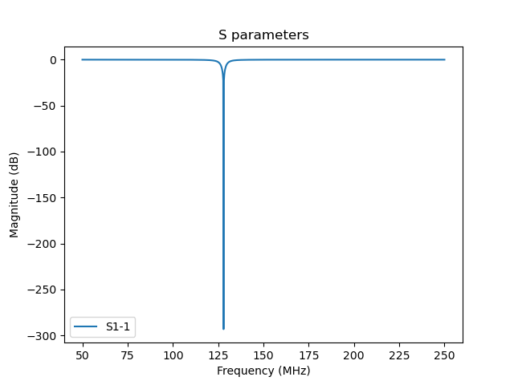

# CoSimPy

CoSimPy is an open source Python library aiming to combine results from electromagnetic (EM) simulation with circuits analysis through a co-simulation environment.

## Summary

  - [Getting Started](#getting-started)
  - [Deployment](#deployment)
  - [Test](#test)
  - [License](#license)
  - [Related Publications](#related-publications)
  - [Acknowledgments](#acknowledgments)

## Getting Started

The library has been developed with Python 3.7 and succesfully tested down to Python 3.5 up to Python 3.10 on Linux, Windows and macOS

### Prerequisites

The library uses the follwong additional packages:

- [numpy](https://numpy.org/) (>=1.15.2)
- [matplotlib](https://matplotlib.org/) (>=3.0.0)
- [h5py](https://www.h5py.org/) (>=2.8.0)
- [scipy](https://www.scipy.org/) (>=1.1.0)

The package versions reported in brackets represent the oldest releases with which the library has been succesfully tested.

### Installing

With [pip](https://pypi.org/project/pip/):
```
pip install cosimpy
```

With [anaconda](https://www.anaconda.com/products/individual):
```
conda install --channel umbertopy cosimpy
```

## Deployment

After installation, the library can be imported as:

```python
import cosimpy
```

### An Example

In the following example, a 1-port RF coil is modeled as a 5 ohm resistance in series with a 300 nH inductance. The RF coil is supposed to generate a 0.1 &mu;T magnetic flux density oriented along the y-direction when it is supplied with 1 W incident power at 128 MHz. The coil is connected to a tuning/matching network through a 5 cm long lossless transmission line. The network is designed to transform the impedance at its output to 50 ohm at 128 MHz. 

```python
import numpy as np
import cosimpy

L_coil = 300e-9 #Coil inductance
R_coil = 5 #Coil resistance

#Frequency values at which the S parameters are evaluated
frequencies = np.linspace(50e6,250e6,1001)

#Number of points along x-, y-, z-direction where the magnetic flux density is evaluated
nPoints = [20,20,20] 

#b_field is evaluated at one frequency (128 MHz) at one port
b_field = np.zeros((1,1,3,np.prod(nPoints)))
#Only the y-component is different from zero 
b_field[:,:,1,:] = 0.1e-6 

#S_Matrix instance to be associated with the RF coil instance
s_coil = cosimpy.S_Matrix.sMatrixRLseries(R_coil,L_coil,frequencies) 
#EM_Field instance defined at 128 MHz to be associated with the RF coil instance
em_coil = cosimpy.EM_Field([128e6], nPoints, b_field)

#RF_Coil instance
rf_coil = cosimpy.RF_Coil(s_coil,em_coil) 

#The average value of the y-component of the magnetic flux density
np.average(np.abs(rf_coil.em_field.b_field[0,0,1,:])).round(10)

'''
Out:
    1e-07
'''

#5 cm, 50 ohm, lossless transmission line
tr_line = cosimpy.S_Matrix.sMatrixTrLine(5e-2,frequencies) 

#Connection between the RF coil and the transmission line
rf_coil_line = rf_coil.singlePortConnRFcoil([tr_line],True) 

#To design the tuning/matching network, I need to know the impedance value at 128 MHz
rf_coil_line.s_matrix[128e6].getZMatrix()

'''
Out:
    array([[[41.66705459+708.46385311j]]])
'''

#The impedance can be transormed to 50 ohm at 128 MHz deploying a T-network made of two capacitors and one inductor with the following values:

Ca = 1.87e-12 #farad
Cb = 27.24e-12 #farad
L = 56.75e-9 #henry

#I create the S_Matrix instances associated with Ca, Cb and L
S_Ca = cosimpy.S_Matrix.sMatrixRCseries(0,Ca,frequencies)
S_Cb = cosimpy.S_Matrix.sMatrixRCseries(0,Cb,frequencies)
S_L = cosimpy.S_Matrix.sMatrixRLseries(0,L,frequencies)

#I create the S_Matrix instance of the tuning/matching network. 
tun_match_network = cosimpy.S_Matrix.sMatrixTnetwork(S_Ca,S_L,S_Cb)

#The RF coil is connected to the matching network. The capacitor Ca will be in series with the transmission line
rf_coil_line_matched = rf_coil_line.singlePortConnRFcoil([tun_match_network], True) 

#The average value of the y-component of the magnetic flux density
np.average(np.abs(rf_coil_line_matched.em_field.b_field[0,0,1,:])).round(10)

'''
Out:
    7.825e-07
'''

rf_coil_line_matched.s_matrix.plotS(["S1-1"])
```


## Test

For testing the library, [pytest](https://docs.pytest.org/en/6.2.x/) is required.<br>
After installing CoSimPy, download the "test" folder and, from a terminal execute:
```
cd path_to_test_folder/test
pytest -v
```
Different tests can be enabled/disabled through the relevant boolean flags in test_develop.py

## License

This project is licensed under the MIT
License - see the [LICENSE](LICENSE) file for
details.

## Related Publications

If you find CoSimPy useful for your work, please consider to cite this [paper](https://www.sciencedirect.com/science/article/pii/S0169260722000694)!


## Acknowledgments

The library has been developed in the framework of the Researcher Mobility Grant (RMG) associated with the european project 17IND01 MIMAS. This RMG: 17IND01-RMG1 MIMAS has received funding from the EMPIR programme co-financed by the Participating States and from the European Union's Horizon 2020 research and innovation programme.

[](https://www.euramet.org/research-innovation/research-empir/)
[](https://www.ptb.de/mimas/home/)

