# CoSimPy
CoSimPy is an open source Python library aiming to combine results from electromagnetic (EM) simulation with circuit analysis through a cosimulation environment.
The library is developed specifically to deal with Magnetic Resonance Imaging (MRI) radiofrequency (RF) coils. Nevertheless, it is sufficiently general to be adopted in any context involving EM multiport simulations.

The library is composed of three different classes:
* [S_Matrix class](#s_matrix-class)
* [EM_Field class](#em_field-class)
* [RF_Coil class](#rf_coil-class)

The **S_Matrix** class is defined to manage the scattering parameters associated with any specific circuit. These can be either the scattering parameters associated with the simulated RF coil or with any other circuit which has to be connected. Specific methods are defined to handle the connection between different instances of its class.

The **EM_Field** class is defined to manage the EM field generated by any port of the simulated device. 

The **RF_Coil** class represents the highest level class of the library. An instance of the RF_Coil class virtually represents the simulated device being, its properties, an *S_Matrix* instance managing the scattering parameters associated with the RF coil and an *EM_Field* instance managing the EM field generated by any port of the RF coil. This class is designed to handle the interaction between the scattering parameters and the EM field allowing the computation of the latter when the RF coil is connected to any other passive device.
___
## S_Matrix class
This class is defined to manage the scattering matrix (S matrix) associated with any specific circuit. These can be either the scattering parameters associated with the simulated RF coil or with any other circuit which has to be connected.

### Properties
* `S_Matrix.S` : *numpy ndarray* <br>
N<sub>f</sub> 🞩 N<sub>P</sub> 🞩 N<sub>P</sub> *numpy ndarray* representing an N<sub>P</sub> ports S matrix defined over N<sub>f</sub> frequency values
* `S_Matrix.frequencies` : *numpy ndarray* <br>
N<sub>f</sub> *numpy ndarray* representing the frequency values, in hertz, over which the scattering parameters are defined
* `S_Matrix.n_f` : *int* <br>
number of frequency values over which the scattering parameters are defined (N<sub>f</sub>)
* `S_Matrix.nPorts` : *int* <br>
number of ports associated with the S Matrix (N<sub>P</sub>)
* `S_Matrix.z0` : *numpy ndarray* <br>
N<sub>P</sub> long *numpy ndarray* representing the real port impedances
* `S_Matrix._S0` : *S_Matrix* <br>
*S_Matrix* associated with the original, unconnected S Matrix. This property is used to store the *S_Matrix* of the original, unconnected S matrix if a connection is performed. If the *S_Matrix* is not the results of any previous connections or connections data has not been stored, this property will be `None`. In addition to the standard properties of the S_Matrix instance, `S_Matrix._S0` also has `S_Matrix._p_incM` and `S_Matrix._phaseM` properties. These are N<sub>f</sub> 🞩 N<sub>P</sub> 🞩 N<sub>P0</sub> *numpy.ndarray* where N<sub>f</sub> is the number of frequency values over which the S matrix is defined, N<sub>P</sub> is equal to `self.nPorts` and N<sub>P0</sub> is equal to `self._S0.nPorts`. `S_Matrix._p_incM(S_Matrix._phaseM)[i,j,k]` represent the absolute value(phase) of the power incident to port `k` of the original, unconnected S matrix, when port `j` of the `self` S matrix is supplied with 1 W incident power. 

### Methods

#### `__init__(self, S, freqs, z0=50, **kwarg)`

It creates an *S_Matrix* instance.

Parameters

* S : *numpy ndarray* <br>
N<sub>f</sub> 🞩 N<sub>P</sub> 🞩 N<sub>P</sub> *numpy ndarray* representing an N<sub>P</sub> ports S Matrix defined over N<sub>f</sub> frequency values
* freqs : *list* or *numpy ndarray* <br>
N<sub>f</sub> *list* or *numpy ndarray* representing the frequency values, in hertz, over which the scattering parameters are defined
* z0 : *int*, *float*, *list* or *numpy ndarray*, *optional*<br>
port impedances in ohm. These can be given as a N<sub>P</sub> *list* or *numpy ndarray*. If all the ports share the same impedances, a *float* or *int* value can be passed as parameter. Default is 50 ohm

Returns

* S_Matrix : *S_Matrix*

Example
```python
import numpy as np
from cosimpy import *

n_p = 5 #Number of ports
n_f = 10 #Number of frequency values 

frequencies = np.linspace(50e6, 150e6, n_f, endpoint=False))

s_real = np.random.rand(n_f,n_p,n_p)
s_imag = np.random.rand(n_f,n_p,n_p)
s = (s_real + 1j*s_imag) /np.max(np.abs(s_real + 1j*s_imag))

S_Matrix(s, frequencies)

'''
Out:

    """""""""""""""
       S MATRIX
    """""""""""""""

    |V-| = |S||V+|
    |5 x 1| = |5 x 5||5 x 1|

    Number of frequency values = 10

'''
```

#### `__repr__(self)`

Method for returning a printable representation of the *S_Matrix* instance.

Parameters

* self : *S_Matrix*
  
Returns

* string : *string* <br>
The string identifies the class of the instance. It gives a textual representation of the S matrix shape and reports the number of frequency values over which the scattering parameters are defined

#### `__getitem__(self, key)`

Indexing method for *S_Matrix* instances. Indices are interpreted as frequency values.

Parameters

* key : *tuple*, *list*, *numpy ndarray*, *int*, *float*, *slice* <br>
frequency values used to index the `self` *S_Matrix*

Returns

* S_Matrix : *S_Matrix*

Example
```python
import numpy as np
from cosimpy import *

n_p = 5 #Number of ports
n_f = 10 #Number of frequency values 

frequencies = np.linspace(50e6, 150e6, n_f, endpoint=False))

S_Mat = S_Matrix(np.random.uniform(size=(n_f,n_p,n_p)), frequencies)

S_Mat.frequencies

'''
Out:

    array([5.0e+07, 6.0e+07, 7.0e+07, 8.0e+07, 9.0e+07, 1.0e+08, 1.1e+08,
       1.2e+08, 1.3e+08, 1.4e+08])
'''

S_Mat[90e6:].frequencies

'''
Out:

    array([9.0e+07, 1.0e+08, 1.1e+08, 1.2e+08, 1.3e+08, 1.4e+08])
'''

S_Mat[90e6:130e6].frequencies

'''
Out:

    array([9.0e+07, 1.0e+08, 1.1e+08, 1.2e+08])
'''
S_Mat[95e6].frequencies

'''
Out:

'WARNING: 9.500000e+07 Hz is not contained in the frequencies list. 9.000000e+07 Hz is returned instead'
    array([90000000.])

'''
```

#### `__add__(self, other)`

\_\_add__ method for *S_Matrix* instances. It computes the *S_Matrix* resultant from the series among 1-port `self` and `other` *S_Matrix* instances. `self` and `other` must be defined over the same frequency values and must share the same port impedance.

Parameters

* self : *S_Matrix* <br>
1-port *S_Matrix*
* other : *S_Matrix* <br>
1-port *S_Matrix*

Returns

* S_Matrix : *S_Matrix* <br>
  1-port *S_Matrix*

Example
```python
import numpy as np
from cosimpy import *

n_f = 10 #Number of frequency values 

frequencies = np.linspace(50e6, 150e6, n_f, endpoint=False))

S_Mat1 = S_Matrix(np.random.uniform(size=(n_f,1,1)), frequencies)
S_Mat2 = S_Matrix.sMatrixShort(frequencies) #S_Mat2: short circuit

S_res = S_Mat1 + S_Mat2

(np.round(S_res.S,6) == np.round(S_Mat1.S,6)).all()

'''
Out:

    True

'''
```

#### `__mul__(self, other)`

\_\_mul__ method for *S_Matrix* instances. It computes the *S_Matrix* resultant from the parallel among 1-port `self` and `other` *S_Matrix* instances. `self` and `other` must be defined over the same frequency values and must share the same port impedance.

Parameters

* self : *S_Matrix* <br>
1-port *S_Matrix*
* other : *S_Matrix* <br>
1-port *S_Matrix*

Returns

* S_Matrix : *S_Matrix* <br>
  1-port *S_Matrix*

Example
```python
import numpy as np
from cosimpy import *

n_f = 10 #Number of frequency values 

frequencies = np.linspace(50e6, 150e6, n_f, endpoint=False))

S_Mat1 = S_Matrix(np.random.uniform(size=(n_f,1,1)), frequencies)
S_Mat2 = S_Matrix.sMatrixShort(frequencies) #S_Mat2: short circuit

S_res = S_Mat1 * S_Mat2

(S_res.S == -1).all()

'''
Out:

    True

'''
```

### `__sub__(self,other)`

\_\_sub__ method for *S_Matrix* instances. It computes the *S_Matrix* resultant from the cascade among the last port of `self` and the first port of `other` *S_Matrix* instances. `self` and `other` must be defined over the same frequency values and the impedance of the last port of `self` and of the first port of `other` must be equal. At least one among `self` and `other` *S_Matrix* instances must have more than 1 port.

Parameters

* self : *S_Matrix* <br>
First *S_Matrix* instance
* other : *S_Matrix* <br>
Second *S_Matrix* instance whose first port is connected to the last port of `self`

Returns

* S_Matrix : *S_Matrix* <br>
  *S_Matrix* instance resulting from the connection between the last port of `self` and the first port of `other`. The returned *S_Matrix* instance has a number of ports equal to the sum of the number of ports of `self` and those of `other` minus one.

Example
```python
import numpy as np
from cosimpy import *

n_f = 10 #Number of frequency values 

frequencies = np.linspace(50e6, 150e6, n_f, endpoint=False)

S_Mat1 = S_Matrix(np.random.uniform(size=(n_f,1,1)), frequencies)
S_Mat2 = S_Matrix(np.repeat(np.array([[[0,1],[1,0]]]),n_f,axis=0),frequencies) #S_Mat2: straight connection from port 1 to 2

S_res = S_Mat1 - S_Mat2

np.isclose(S_res.S,S_Mat1.S).all()

'''
Out:

    True

'''
```

#### `plotS(self, parameters, dB=True, smooth=False)`

The method is used to plot the scattering parameters as a function of the frequency values over which they are defined.

Parameters

* self : *S_Matrix*
* parameters : *list* or *numpy ndarray* <br>
*list* or *numpy ndarray* identifying the scattering parapeters to plot. Each element of parameters must be a string formatted as "S\<n1>-\<n2>" where \<n1> and \<n2> are the relevant port numbers
* dB : *bool*, *optional* <br>
if `True`, the scattering parameters are plotted in Decibel. Otherwise, they are plotted as magnitude and phase. Default is `True`
* smooth : *bool*, *optional* <br>
if `True`, the scattering parameters are interpolated along their frequency range to produce smoother plots. Default is `False`

Returns

* fig : *matplotlib.figure.Figure* <br>
instance of *matplotlib.figure.Figure* relevant to the produced plot

Example
```python
import numpy as np
from cosimpy import *

n_p = 5 #Number of ports
n_f = 10 #Number of frequency values 

frequencies = np.linspace(50e6, 150e6, n_f, endpoint=False)

S_Mat = S_Matrix(np.random.uniform(size=(n_f,n_p,n_p)), frequencies)

fig = S_Mat.plotS(["S1-1, S1-2, S3-2"])
```

#### `plotSPanel(self, num_nn, smooth=False)`

The method is used to plot the scattering parameters in dB as a function of the frequency values over which they are defined in a multi-panel figure. Each panel il relevant to a S<sub>n,n</sub> parameter with n from one to the number of ports of `self`.

Parameters

* self : *S_Matrix*
* num_nn : *int* <br>
numbers of nearest neighbours to be plotted in each panel. For each port N, in each figure panel will be plotted the S parameters from S<sub>N,N-num_nn</sub> to S<sub>N,N+num_nn</sub>
* smooth : *bool*, *optional* <br>
if `True`, the scattering parameters are interpolated along their frequency range to produce smoother plots. Default is `False`

Returns

* fig : *matplotlib.figure.Figure* <br>
instance of *matplotlib.figure.Figure* relevant to the produced plot

Example
```python
import numpy as np
from cosimpy import *

n_p = 5 #Number of ports
n_f = 10 #Number of frequency values 

frequencies = np.linspace(50e6, 150e6, n_f, endpoint=False)

S_Mat = S_Matrix(np.random.uniform(size=(n_f,n_p,n_p)), frequencies)

fig = S_Mat.plotSPanel(3)
```

<p align="center">
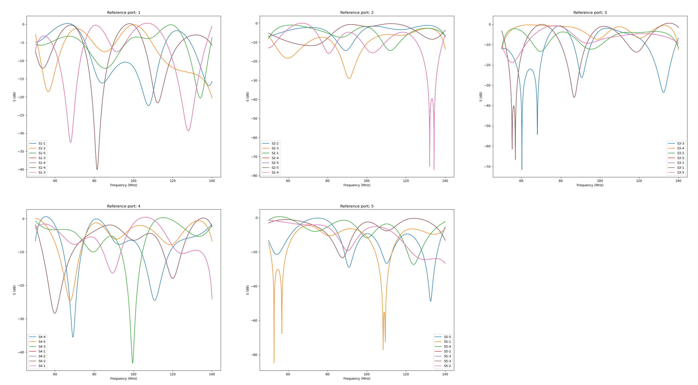
</p>

#### `getZMatrix(self)`

it returns the Z matrix associated with the *S_Matrix* `self`

Parameters

* self : *S_Matrix*

Returns

* Z : *numpy ndarray* <br>
  N<sub>f</sub> 🞩 N<sub>P</sub> 🞩 N<sub>P</sub> *numpy ndarray* of impedance parameters. N<sub>f</sub> is the number of frequency values over which `self` is defined and N<sub>P</sub> is the number of ports

#### `getYMatrix(self)`

it returns the Y matrix associated with the *S_Matrix* `self`

Parameters

* self : *S_Matrix*

Returns

* Y : *numpy ndarray* <br>
  N<sub>f</sub> 🞩 N<sub>P</sub> 🞩 N<sub>P</sub> *numpy ndarray* of admittance parameters. N<sub>f</sub> is the number of frequency values over which `self` is defined and N<sub>P</sub> is the number of ports

#### `compVI(self)`

The method returns the voltages and currents at the S matrix ports when 1 W power is incident to one port and the other ports are closed over their characteristic impedance. If a connection with an external network has been performed and connection data have been stored, it also returns voltages and currents at the ports of the unconnected S matrix (*i.e* unconnected system in the figure below).

<p align="center">
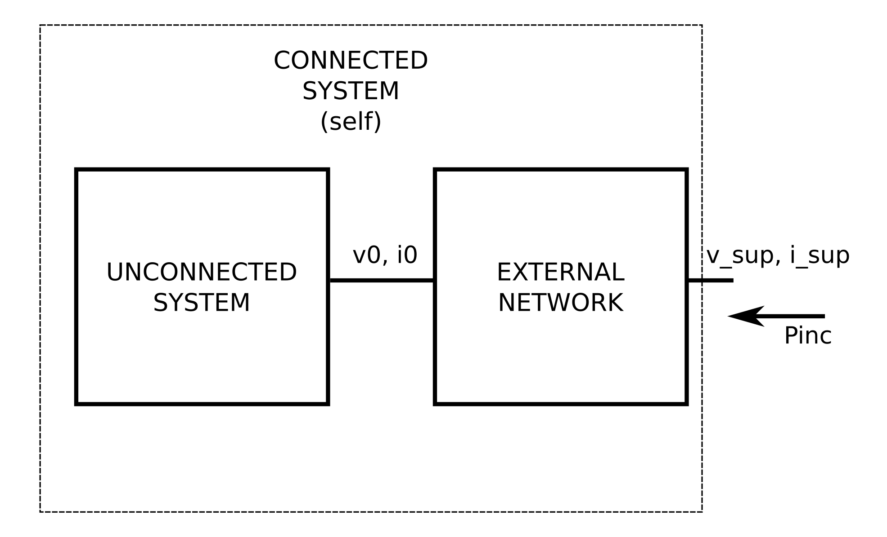
</p>

Parameters

* self : *S_Matrix*

Returns

* v_sup : *numpy ndarray* <br>
  N<sub>f</sub> 🞩 N<sub>P</sub> 🞩 N<sub>P</sub> *numpy ndarray* where N<sub>f</sub> is the number of frequency values over which `self` is defined and N<sub>P</sub> is the number of ports of `self`. `v_sup[i,j,k]` represents the voltage, at a frequency equal to `self.frequencies[i]`, at the j-port when 1 W power is incident to the k-port and all the other ports are closed over their characteristic load
* i_sup : *numpy ndarray* <br>
  N<sub>f</sub> 🞩 N<sub>P</sub> 🞩 N<sub>P</sub> *numpy ndarray* where N<sub>f</sub> is the number of frequency values over which `self` is defined and N<sub>P</sub> is the number of ports of `self`. `i_sup[i,j,k]` represents the current, at a frequency equal to `self.frequencies[i]`, at the j-port when 1 W power is incident to the k-port and all the other ports are closed over their characteristic load. If the current phase is between $-\pi/2$ and $\pi/2$, the current is entering the relevant port. Otherwise, the current is exiting the relevant port
* v0 : *numpy ndarray*, *optional* <br>
  N<sub>f</sub> 🞩 N<sub>P,0</sub> 🞩 N<sub>P</sub> *numpy ndarray* where N<sub>f</sub> is the number of frequency values over which `self` is defined, N<sub>P,0</sub> is the number of ports of the unconnected S matrix with an external network and N<sub>P</sub> is the number of ports of `self`. `v0[i,j,k]` represents the voltage, at a frequency equal to `self.frequencies[i]`, at the j-port of the unconnected S matrix when 1 W power is incident to the k-port of `self` and all its other ports are closed over their characteristic load
* i0 : *numpy ndarray*, *optional* <br>
  N<sub>f</sub> 🞩 N<sub>P,0</sub> 🞩 N<sub>P</sub> *numpy ndarray* where N<sub>f</sub> is the number of frequency values over which `self` is defined, N<sub>P,0</sub> is the number of ports of the unconnected S matrix and N<sub>P</sub> is the number of ports of `self`. `i0[i,j,k]` represents the current, at a frequency equal to `self.frequencies[i]`, at the j-port of the unconnected S matrix when 1 W power is incident to the k-port of `self` and all its other ports are closed over their characteristic load. If the current phase is between $-\pi/2$ and $\pi/2$, the current is entering the relevant port. Otherwise, the current is exiting the relevant port

#### `powerBalance(self, p_inc)`

The method returns the power accepted by the system when each port of the S matrix is supplied according to the incident powers passed in the p_inc list. If a connection with an external network has been performed and connection data have been stored, it also returns the power accepted by the S matrix before the last connection (*i.e* unconnected system in the figure below). The difference of the two accepted powers reflects the losses in the connected network

<p align="center">
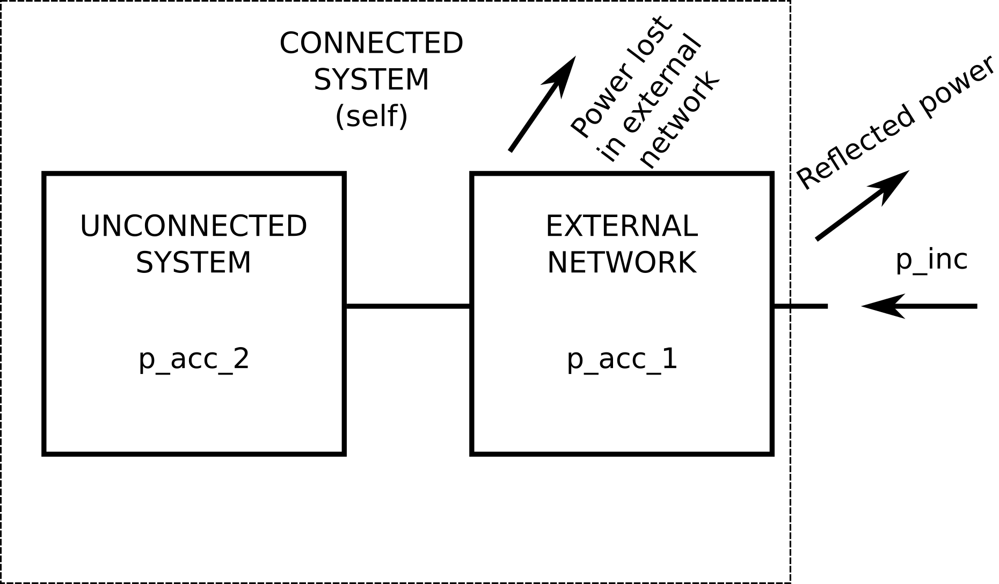
</p>

Parameters
* self : *S_Matrix*
* p_inc : *list*, *numpy ndarray* <br>
  *list* or *numpy ndarray* with length equal to the number of ports of `self`. `p_inc[i]` is the power incident to the i-th port of `self` to be considered for the power balance computation

Returns

* p_acc_1 : *numpy ndarray* <br>
  *numpy ndarray* with length equal to the number of frequencies over which `self` is defined. `p_acc_1[i]` is the power accepted by the system at a frequency equal to `self.frequencies[i]` when all the S matrix ports are supplied according to the incident powers listed in the p_inc argument
* p_acc_2 : *numpy ndarray*, *optional* <br>
  *numpy ndarray* with length equal to the number of frequencies over which `self` is defined. `p_acc_2[i]` is the power accepted by the system, before have been connected with external networks, at a frequency equal to `self.frequencies[i]` when all the S matrix ports of `self` (*i.e.* the connected system) are supplied according to the incident powers listed in the p_inc argument

#### `healSMatrix(self, report=False, f_tol=1e-10, rdiff=None, **kwarg)`

For a passive system, the matrix defined as $II - S^HS$ is positive semi-definite. Due to numerical errors, it could happen that the given S matrix does not satisfy this constraint. This methods tries to compute a new S matrix, starting from the original `self.S` S matrix, being compliant with the above constraint.

Parameters
* self : *S_Matrix*
* report : *bool*, *optional* <br>
  if `True` the method returns a report relevant to the new computed S matrix
* f_tol : *float*, *optional* <br>
  absolute tolerance (in max-norm) for the residual related to the Newton-Krylov algorithm adopted to compute the new S matrix. Default is 1e-10
* rdiff : *float*, *optional* <br>
  relative step size to use in numerical differentiation related to the Newton-Krylov algorithm adopted to compute the new S matrix. Default is `None`

Returns

* S_Matrix : *S_Matrix* <br>
  *S_Matrix* obtained from the recomputed S matrix
* *dict*, *optional* <br>
  dictionary with the following keys:
    - *max_abs_Sdiff* : *numpy  ndarray*<br>
      *numpy  ndarray* with a length equal to the number of frequency values over which the S matrix is defined. For each frequency, it reports the maximum absolute value of the difference between the original and recomputed S parameters
    - *min_eig_val* : *numpy  ndarray*<br>
      *numpy  ndarray* with a length equal to the number of frequency values over which the S matrix is defined. For each frequency, it reports the minimum eigenvalue of the matrix defined as $II - S^HS$ where $S$ is the recomputed S matrix

#### `setAsOriginal(self)`

When a device is connected to external circuitries, its original S matrix and the complex powers incident to its ports, when 1 W power is incident to the new ports of the connected deveice, can be stored. These data allows to compute the power balance distingushing the power absorbed by the unconnected device and that absorbed by the external circuitry. This method set the *S_Matrix* instance as *unconnected*. As a consequence, any previously connected circuitry becomes part of the original device and are not treated separately when relevant methods are called

Parameters
* self : *S_Matrix*

Returns

* None

#### `exportTouchstone(self, filename, version="1.1", options=None)`

Method designed to export the *S_Matrix* instance in a *Touchstone* file.

Parameters

* self : *S_Matrix*
* filename : *string* <br>
*string* reporting the *Touchstone* file name
* version : *string* or None, *optional* <br>
*string* or `None` representing the Touchstone file version. In the preset version of the library, version can either be "1.1" or None. If "1.1" the Touchstone file is  compliant to the Touchstone® File Format Specification Rev. 1.1. If version is `None`, the file is formatted as a multiple rows text file where each row corresponds to a single frequency value followed by the associated parameters separated by space or tab characters:

  f1 p11 p12 ... p1n p21 p22 ... pn1 pn2 ... pnn<br>
  f2 ...<br>
  .<br>
  .<br>
  .<br>

* options : *dict* or *None*<br>
*dict* or `None` argument reporting the options relevant to the exported file. In case it is a dictionary, it may contain the following key:
  - format : *string*, optional <br>
  *string* defining the format of the parameters saved in the file. The string can be equal to:
    * 'RI' : Real and Imaginary parts
    * 'MA' : Magnitude and phase in degrees
    * 'DB' : Magnitude in decibel and phase in degrees
    * 'MA_Rad' : Magnitude and phase in radians (This is not contemplated in Touchstone Rev. 1.1)
    * 'DB_Rad' : Magnitude in decibel and phase in radians (This is not contemplated in Touchstone Rev 1.1)

    Default is 'MA'
    
  - frequency_unit : *string*, *optional* <br>
  *string* defining the measurement unit of the frequency values reported in the *Touchstone* file. It can be equal to 'Hz', 'kHz, 'MHz' or 'GHz'. Default is 'GHz'

  - parameter : *string*, *optional*<br>
  *string* defining the parameter type reported in the file. It can be equal to 'S', 'Z', 'Y'. Default is 'S'<br>

  If `None`, all the default values reported above are considered as exporting options


Returns

* *None*

#### `_singlePortConnSMatrix(self, networks, comp_Pinc=False)`

The method performs the cascade connection between `self` and the *S_Matrix* instances contained in `networks` *list*. This method is not meant to be used directly but it is called by the `singlePortConnRFcoil` method of *RF_Coil* class. The latter method should be used by the user.

Parameters

* self : *S_Matrix*
* networks : *list* <br>
*list*, with length equal to the number of ports of `self`, either containing `None` values or *S_Matrix* instances defined over the same frequency values of `self`. If the n-th element of `networks` is `None`, the n-th port of `self` is not connected to any other network in the returned *S_Matrix*. If the n-th element of `networks` is an N-ports *S_Matrix*, its first port must share the same impedance of the n-th port of `self` and the two ports are connected together. In the returned *S_Matrix*, the n-th port of `self` is therefore expanded into (N-ports - 1) ports. The example proposed in the image below should clarify the workflow
* comp_Pinc : *bool*, *optional* <br>
  if `True` the method returns the magnitude and 'phase' of the incident powers across the ports of `self` when each port of the returned S matrix is supplied with 1 W of incident power and all its other ports are closed on characteristic loads. Default is `False`

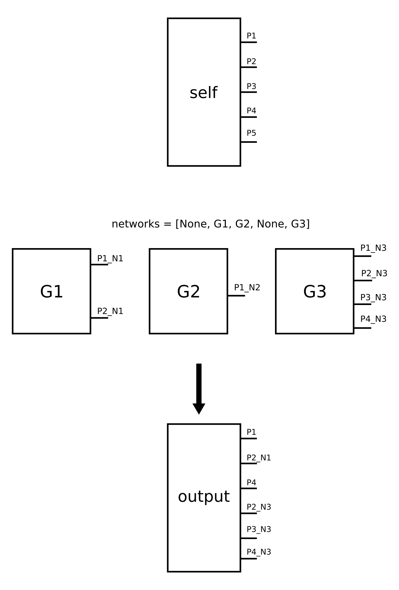

Returns

* S_res : *S_Matrix* <br>
  The *S_Matrix* which results from the connection. The *S_Matrix* is defined over the same frequency values of `self` and has a number of ports equal to N<sub>P</sub> - N<sub>T</sub> + &sum;<sub>i=1</sub><sup>N<sub>T</sub></sup>(N<sub>p,i</sub> - 1) where N<sub>P</sub> is the number of ports of `self`, N<sub>T</sub> is the number of *S_Matrix* instances in `networks` and N<sub>p,i</sub> is the number of ports of the i-th *S_Matrix* of `networks`. The n-th port impedance of S_res is equal to the impedance of the relevant port of `self` if it derives from a `None` element of `networks`. Otherwise, it is equal to the impedance of the relevant port of the *S_Matrix* of `networks` from which the port derives
* p_incM : *numpy ndarray*, *optional* <br>
  N<sub>f</sub> 🞩 N<sub>Pout</sub> 🞩 N<sub>P</sub> *numpy ndarray* where N<sub>f</sub> is the number of frequency values over which `self` is defined, N<sub>Pout</sub> is the number of ports of the returned *S_Matrix* and N<sub>P</sub> is the number of ports of `self`. `PincM[i,j,k]` represents the magnitude of the incident power at the k-port of `self` when the j-port of the output *S_Matrix* is supplied with 1 W incident power at a frequency equal to `self.frequencies[i]`
* phaseM : *numpy ndarray*, *optional* <br>
  N<sub>f</sub> 🞩 N<sub>Pout</sub> 🞩 N<sub>P</sub> *numpy ndarray* where N<sub>f</sub> is the number of frequency values over which `self` is defined, N<sub>Pout</sub> is the number of ports of the returned *S_Matrix* and N<sub>P</sub> is the number of ports of `self`. 
  `phaseM[i,j,k]` represents the 'phase' of the incident power at the k-port of `self` when the j-port of the output *S_Matrix* is supplied with 1 W incident power at a frequency equal to `self.frequencies[i]`

Example
```python
import numpy as np
from cosimpy import *

n_f = 10 #Number of frequency values 

frequencies = np.linspace(50e6, 150e6, n_f, endpoint=False))

s = np.repeat(np.array([[[0, 1], [1, 0]]]), n_f, axis=0) #Straight connection between port 1 and port 2
S_Mat = S_Matrix(s, frequencies)
S_ch = S_Matrix(np.zeros((n_f,1,1)), frequencies) #Characteristic load

S_res, p_incM, phaseM = S_Mat._singlePortConnSMatrix([None, S_ch], True)

np.array_equal(S_res.S,np.repeat([[[0]]],10,axis=0))

'''
Out:

    True
'''

np.array_equal(np.round(p_incM,10),np.repeat([[[1., 0.]]],n_f,axis=0))

'''
Out:

    True
'''

np.equal(phaseM, np.zeros_like(phaseM)).all()

'''
Out:

    True

'''
```

#### `_fullPortsConnSMatrix(self, other, comp_Pinc=False)`

The method performs the cascade connection between `self` and `other` *S_Matrix* instances. This method is not meant to be used directly but it is called by the `fullPortsConnRFcoil` method of *RF_Coil* class. The latter method should be used by the user.

Parameters

* self : *S_Matrix*
* other : *S_Matrix* <br>
*S_Matrix* instance defined over the same frequency values of `self` and with a number of ports higher than those of `self`. In the returned *S_Matrix*, the first N<sub>P</sub> ports of `other` are connected with the N<sub>P</sub> ports of `self` and must share the same port impedances
* comp_Pinc : *bool*, *optional* <br>
if `True` the method returns the magnitude and 'phase' of the incident powers across the ports of `self` when each port of the returned S matrix is supplied with 1 W of incident power and all its other ports are closed on characteristic loads. Default is `False`

Returns

* S_res : *S_Matrix* <br>
  The *S_Matrix* which results from the connection. The *S_Matrix* is defined over the same frequency values of `self` and has a number of ports equal to N<sub>Po</sub> - N<sub>P</sub> being N<sub>P</sub> the number of ports of `self` and N<sub>Po</sub> the number of ports of `other`. The port impedances of S_res will be equal to those of the last N<sub>Po</sub> ports of other
* p_incM : *numpy ndarray*, *optional* <br>
  N<sub>f</sub> 🞩 N<sub>Pout</sub> 🞩 N<sub>P</sub> *numpy ndarray* where N<sub>f</sub> is the number of frequency values over which `self` is defined, N<sub>Pout</sub> is the number of ports of the returned *S_Matrix* and N<sub>P</sub> is the number of ports of `self`. 
  PincM[i,j,k] represents the magnitude of the incident power at the k-port of `self` when the j-port of the output *S_Matrix* is supplied with 1 W incident power at a frequency equal to `self.frequencies[i]`
* phaseM : *numpy ndarray*, *optional* <br>
  N<sub>f</sub> 🞩 N<sub>Pout</sub> 🞩 N<sub>P</sub> *numpy ndarray* where N<sub>f</sub> is the number of frequency values over which `self` is defined, N<sub>Pout</sub> is the number of ports of the returned *S_Matrix* and N<sub>P</sub> is the number of ports of `self`. 
  phaseM[i,j,k] represents the 'phase' of the incident power at the k-port of `self` when the j-port of the output *S_Matrix* is supplied with 1 W incident power at a frequency equal to `self.frequencies[i]`

  Example
```python
import numpy as np
from scipy.linalg import circulant
from cosimpy import *

n_p = 2 #Number of ports
n_f = 10 #Number of frequency values 

frequencies = np.linspace(50e6, 150e6, n_f, endpoint=False))

S_Mat = S_Matrix(np.random.uniform(size=(n_f,n_p,n_p)), frequencies)

s_other = circulant([0,0,1,0]).T #Straight connection between ports 1 with port 3 and port 2 with port 4

s_other

'''
Out:

    array([[0, 0, 1, 0],
          [0, 0, 0, 1],
          [1, 0, 0, 0],
          [0, 1, 0, 0]])
'''

other = S_Matrix(np.repeat([s_other], n_f, axis=0), frequencies)

S_res, p_incM, phaseM = S_Mat._fullPortsConnSMatrix(other, True)

(np.round(S_res.S,10) == np.round(S_Mat.S,n_f)).all()

'''
Out:

    True
'''

np.equal(np.round(p_incM, 10),np.repeat([[[1,0],[0,1]]], n_f, axis=0)).all()

'''
Out:

    True
'''

np.equal(phaseM, np.zeros_like(phaseM)).all()

'''
Out:

    True

'''
```

#### `_sMatrixConnectPorts(self, port_pairs, sMats)`

The method returns an *S_Matrix* instance that, if connected to the `self` *S_Matrix*, results in a *S_Matrix* instance where the port pairs listed in `port_pairs` aurgument are connected together through the *S_Matrix* instances listed in `sMats`. This method is not meant to be used directly but it is called by the `connectPorts` method of *RF_Coil* class. The latter method should be used by the user.

Parameters

* self : *S_Matrix*
* port_pairs : *list*, *numpy.ndarray* <br>
N<sub>PP</sub> 🞩 2 *list* or *numpy.ndarray* listing the port pairs that have to be connected together through the N<sub>PP</sub> *S_Matrix* instances listed in `sMats`
* sMats : *list*, *numpy.ndarray* <br>
N<sub>PP</sub> *list* or *numpy.ndarray* listing the *S_Matrix* instances used to connect together the port pairs listed in `port_pairs`. Each *S_Matrix* instance has to be defined over the same frequency values over which the `self` *S_Matrix* instance is defined

<p align="center">
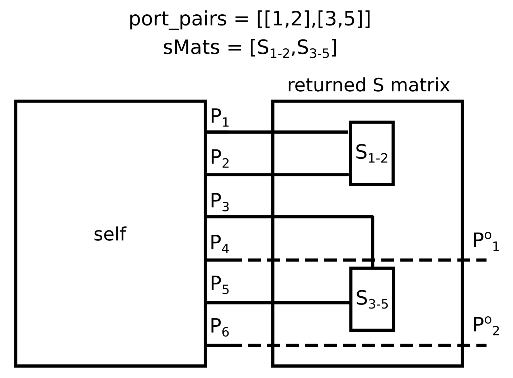
</p>

Returns

* s_load : *S_Matrix* <br>
*S_Matrix* instance with a number of ports equal to 2(N<sub>P</sub>-N<sub>PP</sub>), where N<sub>P</sub> is the number of ports of `self` and N<sub>PP</sub> is the number of port pairs that have to be connected together through the *S_Matrix* instances listed in `sMats`. 

#### `__resSMatrix(self, other)`

Private method used to compute the *S_Matrix* instance resulting from the connection of the N<sub>P</sub> ports of `self` with the first N<sub>P</sub> ports of `other`.

Parameters

* self : *S_Matrix*
* other : *S_Matrix* <br>
S_Matrix instance* defined over the same frequency values of `self` and with a number of ports higher than those of `self`. In the returned *S_Matrix*, the first N<sub>P</sub> ports of `other` are connected with the N<sub>P</sub> ports of `self` and must share the same port impedances


Returns

* S_res : *S_Matrix* <br>
  The *S_Matrix* which results from the connection of `self` with `other`. The *S_Matrix* is defined over the same frequency values of `self` and has a number of ports equal to N<sub>Po</sub> - N<sub>P</sub> being N<sub>P</sub> the number of ports of `self` and N<sub>Po</sub> the number of ports of `other`. The port impedances of S_res will be equal to those of the last N<sub>Po</sub> ports of other

#### `__load_Pinc(self, other, comp_Pinc=False)`

Private method used to compute the magnitude and 'phase' of the powers incident to the ports of `self` when the last port of `other` is supplied with 1 W incident power.

Parameters

* self : *S_Matrix*
* other : *S_Matrix* <br>
S_Matrix instance* defined over the same frequency values of `self` and with a number of ports equal to (N<sub>P</sub> + 1) where N<sub>P</sub> is equal to the number of ports of `self`. The first N<sub>P</sub> ports of `other` must share the same port impedances of the ports of `self`

Returns

* p_incM : *numpy ndarray* <br>
  N<sub>f</sub> 🞩 1 🞩 N<sub>P</sub> *numpy ndarray* where N<sub>f</sub> is the number of frequency values over which `self` is defined and N<sub>P</sub> is the number of ports of `self`. 
  PincM[i,0,k] represents the magnitude of the incident power at the k-port of `self` when the last port of `other` is supplied with 1 W incident power at a frequency equal to `self.frequencies[i]`
* phaseM : *numpy ndarray* <br>
  N<sub>f</sub> 🞩 1 🞩 N<sub>P</sub> *numpy ndarray* where N<sub>f</sub> is the number of frequency values over which `self` is defined and N<sub>P</sub> is the number of ports of `self`. 
  phaseM[i,0,k] represents the 'phase' of the incident power at the k-port of `self` when the last port of `other` is supplied with 1 W incident power at a frequency equal to `self.frequencies[i]`

#### `__findFreqIndex(self, freq)`

Private method which returns the index of `self.frequencies` corresponding to the frequency `freq`.

Parameters

* self : *S_Matrix*
* freq : *float* <br>

Returns

* idx : *int* <br>
Index of of `self.frequencies` corresponding to the frequency `freq`. In case `freq` is not in `self.frequencies`, the lower index of the nearest element of `self.frequencies` to `freq` is returned

#### `fromZtoS(cls, Z, freqs, z0 = 50)`

*class method* used to return an *S_Matrix* starting from an impedance matrix defined over the frequency values listed in `freqs`.

Parameters

* cls : *S_Matrix* class <br>
* Z : *numpy ndarray* <br>
N<sub>f</sub> 🞩 N<sub>P</sub> 🞩 N<sub>P</sub> *numpy ndarray* of impedance parameters. N<sub>f</sub> is the number of frequency values over which the impedance parameters are defined. N<sub>P</sub> is the number of ports
* freqs : *list*, *numpy ndarray* <br>
N<sub>f</sub> *list* or *numpy ndarray* containing the frequency values, in hertz, over which the impedance parameters are defined
* z0 : *int*, *float*, *list* or *numpy ndarray*, *optional*<br>
port impedances in ohm. These can be given as a N<sub>P</sub> *list* or *numpy ndarray*. If all the ports share the same impedances, an *int* or *float* value can be passed as parameter. Default is 50 ohm

Returns

* S_Matrix : *S_Matrix* <br>
*S_Matrix* obtained from the conversion of the impedance parameters and defined over the frequency values listed in `freqs`. The port impedances of the returned *S_Matrix* are given by the relevant method parameter

#### `fromYtoS(cls, Z, freqs, y0 = 0.02)`

*class method* used to return an *S_Matrix* starting from an admittance matrix defined over the frequency values listed in `freqs`.

Parameters

* cls : *S_Matrix* class <br>
* Z : *numpy ndarray* <br>
N<sub>f</sub> 🞩 N<sub>P</sub> 🞩 N<sub>P</sub> *numpy ndarray* of admittance parameters. N<sub>f</sub> is the number of frequency values over which the admittance parameters are defined. N<sub>P</sub> is the number of ports
* freqs : *list*, *numpy ndarray* <br>
N<sub>f</sub> *list* or *numpy ndarray* containing the frequency values, in hertz, over which the admittance parameters are defined
* y0 : *int*, *float*, *list* or *numpy ndarray*, *optional*<br>
port admittances. These can be given as a N<sub>P</sub> *list* or *numpy ndarray*. If all the ports share the same admittances, an *int* or *float* value can be passed as parameter.  Default is 0.02 S

Returns

* S_Matrix : *S_Matrix* <br>
*S_Matrix* obtained from the conversion of the admittance parameters and defined over the frequency values listed in `freqs`. The port impedances of the returned *S_Matrix* are obtained from the port admittances given by the relevant method parameter

#### `importTouchstone(cls, filename, version="1.1", options=None, **kwarg)`

*class method* used to return an *S_Matrix* importing the scattering parameters from a *Touchstone* file.

Parameters

* cls : *S_Matrix* class
* filename : *string* <br>
*string* reporting the *Touchstone* file name
* version : *string* or *None*, *optional* <br>
*string* or `None` representing the Touchstone file version. In the preset version of the library, version can either be "1.1" or `None`. If "1.1" the Touchstone file has to be compliant with the Touchstone® File Format Specification Rev. 1.1. If version is `None`, the file to be imported has to be formatted as a multiple rows text file where each row corresponds to a single frequency value followed by the associated parameters separated by space or tab characters:

  f1 p11 p12 ... p1n p21 p22 ... pn1 pn2 ... pnn<br>
  f2 ...<br>
  .<br>
  .<br>
  .<br>
Default is "1.1"
* options : *dict* or *None*, *optional*<br>
This argument is not considered if version is different from `None`. Otherwise, it has to be a dictionary with the following keys:
  - format : *string* <br>
  *string* defining the format of the parameters saved in the file. The string can be equal to:
    * 'RI' : Real and Imaginary parts
    * 'MA' : Magnitude and phase in degrees
    * 'DB' : Magnitude in decibel and phase in degrees
    * 'MA_Rad' : Magnitude and phase in radians
    * 'DB_Rad' : Magnitude in decibel and phase in radians<br>
  
  - frequency_unit : *string*<br>
  *string* defining the measurement unit of the frequency values reported in the *Touchstone* file. It can be equal to 'Hz', 'kHz, 'MHz' or 'GHz'.

  - parameter : *string*<br>
  *string* defining the parameter type reported in the file. It can be equal to 'S', 'Z', 'Y'.

  - number_of_ports : *int* <br>
  *int* defining the number of ports saved in the file.

  - port_references : *int*, *float*, *list*, *numpy ndarray* <br>
  port impedances, if "parameter" key is equal to 'S' or 'Z', port admittance if "parameter" key is equal to 'Y'. If *int* or *float*, all the ports are assumed to share the same port reference. If *list* or *numpy ndarray*, its length must be equal to the number of ports saved in the file.

  - comments : *list*, *numpy ndarray*, *optional* <br>
  list containing the characters identifying the comment lines in the file. Default is ['#', '!']

  Default is `None`

Returns

* S_Matrix : *S_Matrix* <br>
*S_Matrix* obtained from the *Touchstone* file

#### `sMatrixShort(cls, freqs, z0=50)`

*class method* used to return an *S_Matrix* of a 1-port short circuit.

Parameters

* cls : *S_Matrix* class <br>
* freqs : *list*, *numpy ndarray*<br>
*list*, *numpy ndarray* reporting the frequency values, in hertz, over which the returned *S_Matrix* is defined
* z0 : *float*, *optional* <br>
The impedance, in ohm, of the port of the returned  *S_Matrix*. Default is 50 ohm

Returns

* S_Matrix : *S_Matrix* <br>
1-port *S_Matrix*, defined over the frequency values passed as method parameter, of a short circuit. The port impedance is specified as method parameter

#### `sMatrixOpen(cls, freqs, z0=50)`

*class method* used to return an *S_Matrix* of a 1-port open circuit.

Parameters

* cls : *S_Matrix* class <br>
* freqs : *list*, *numpy ndarray*<br>
*list*, *numpy ndarray* reporting the frequency values, in hertz, over which the returned *S_Matrix* is defined
* z0 : *float*, *optional* <br>
The impedance, in ohm, of the port of the returned  *S_Matrix*. Default is 50 ohm

Returns

* S_Matrix : *S_Matrix* <br>
1-port *S_Matrix*, defined over the frequency values passed as method parameter, of an open circuit. The port impedance is specified as method parameter

#### `sMatrixRCseries(cls, Rvalue, Cvalue, freqs, z0=50)`

*class method* used to return an *S_Matrix* of a 1-port Resistance-Capacitance series circuit.

Parameters

* cls : *S_Matrix* class <br>
* Rvalue : *float* <br>
The resistance value in ohm
* Cvalue : *float* <br>
The capacitance value in farad
* freqs : *list*, *numpy ndarray*<br>
*list*, *numpy ndarray* reporting the frequency values, in hertz, over which the returned *S_Matrix* is defined
* z0 : *float*, *optional* <br>
The impedance, in ohm, of the port of the returned  *S_Matrix*. Default is 50 ohm

Returns

* S_Matrix : *S_Matrix* <br>
1-port *S_Matrix*, defined over the frequency values passed as method parameter, of a Resistance-Capacitance series. The port impedance is specified as method parameter

#### `sMatrixRLseries(cls, Rvalue, Lvalue, freqs, z0=50)`

*class method* used to return an *S_Matrix* of a 1-port Resistance-Inductance series circuit.

Parameters

* cls : *S_Matrix* class <br>
* Rvalue : *float* <br>
The resistance value in ohm
* Lvalue : *float* <br>
The inductance value in henry
* freqs : *list*, *numpy ndarray*<br>
*list*, *numpy ndarray* reporting the frequency values, in hertz, over which the returned *S_Matrix* is defined
* z0 : *float*, *optional* <br>
The impedance, in ohm, of the port of the returned *S_Matrix*.  Default is 50 ohm

Returns

* S_Matrix : *S_Matrix* <br>
1-port *S_Matrix*, defined over the frequency values passed as method parameter, of a Resistance-Inductance series. The port impedance is specified as method parameter

#### `sMatrixRCparallel(cls, Rvalue, Cvalue, freqs, z0=50)`

*class method* used to return an *S_Matrix* of a 1-port Resistance-Capacitance parallel circuit.

Parameters

* cls : *S_Matrix* class <br>
* Rvalue : *float* <br>
The resistance value in ohm
* Cvalue : *float* <br>
The capacitance value in farad
* freqs : *list*, *numpy ndarray*<br>
*list*, *numpy ndarray* reporting the frequency values, in hertz, over which the returned *S_Matrix* is defined
* z0 : *float*, *optional* <br>
The impedance, in ohm, of the port of the returned *S_Matrix*. Default is 50 ohm

Returns

* S_Matrix : *S_Matrix* <br>
1-port *S_Matrix*, defined over the frequency values passed as method parameter, of a Resistance-Capacitance parallel. The port impedance is specified as method parameter

#### `sMatrixRLparallel(cls, Rvalue, Lvalue, freqs, z0=50)`

*class method* used to return an *S_Matrix* of a 1-port Resistance-Inductance parallel circuit.

Parameters

* cls : *S_Matrix* class <br>
* Rvalue : *float* <br>
The resistance value in ohm
* Lvalue : *float* <br>
The inductance value in henry
* freqs : *list*, *numpy ndarray*<br>
*list*, *numpy ndarray* reporting the frequency values, in hertz, over which the returned *S_Matrix* is defined
* z0 : *float*, *optional* <br>
The impedance, in ohm of the port of the returned *S_Matrix*. Default is 50 ohm

Returns

* S_Matrix : *S_Matrix* <br>
1-port *S_Matrix*, defined over the frequency values passed as method parameter, of a Resistance-Inductance parallel. The port impedance is specified as method parameter

#### `sMatrixTnetwork(cls, SL_1, SL_2, ST, z0=50)`

*class method* used to return an *S_Matrix* of a 2-port T-network.

Parameters

* cls : *S_Matrix* class <br>
* SL_1 : *S_Matrix*, *None* <br>
The 1-port S_Matrix of the longitudinal parameter of the T-network towards the first port. If `None`, a short circuit will be considered
* SL_2 : *S_Matrix*, *None* <br>
The 1-port S_Matrix of the longitudinal parameter of the T-network towards the second port. If `None`, a short circuit will be considered
* ST : *S_Matrix* <br>
The 1-port S_Matrix of the transversal parameter of the T-network
* z0 : *int*, *float*, *list* or *numpy ndarray*, *optional*<br>
port impedances in ohm. These can be given as a 2-element *list* or *numpy ndarray*. If all the ports share the same impedances, an *int* or *float* value can be passed as parameter. Default is 50 ohm

<p align="center">
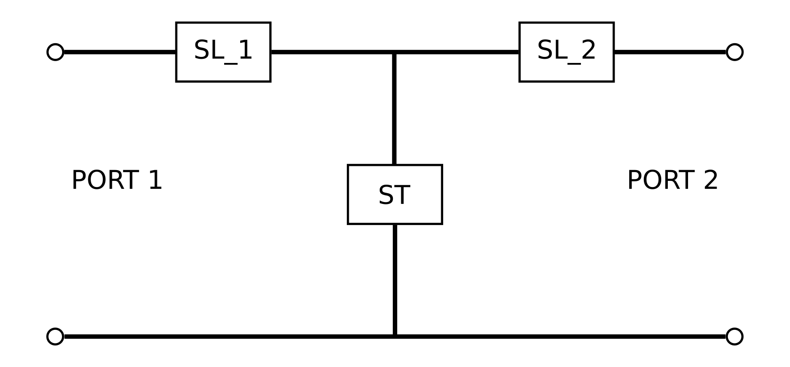
</p>

Returns

* S_Matrix : *S_Matrix* <br>
2-port *S_Matrix*, of the T-network defined over the same frequency values over which SL_1, SL_2 and ST are defined. The impedances of the two ports are specified by the relevant method parameter

#### `sMatrixPInetwork(cls, ST_1, ST_2, SL, z0=50)`

*class method* used to return an *S_Matrix* of a 2-port PI-network.

Parameters

* cls : *S_Matrix* class <br>
* ST_1 : *S_Matrix*, *None* <br>
The 1-port S_Matrix of the transversal parameter of the PI-network towards the first port. If `None`, an open circuit will be considered
* ST_2 : *S_Matrix*, *None* <br>
The 1-port S_Matrix of the transversal parameter of the PI-network towards the second port. If `None`, an open circuit will be considered
* SL : *S_Matrix* <br>
The 1-port S_Matrix of the longitudinal parameter of the PI-network
* z0 : *int*, *float*, *list* or *numpy ndarray*, *optional*<br>
port impedances. These can be given as a 2-element *list* or *numpy ndarray*. If all the ports share the same impedances, an *int* or *float* value can be passed as parameter. Default is 50 ohm

<p align="center">
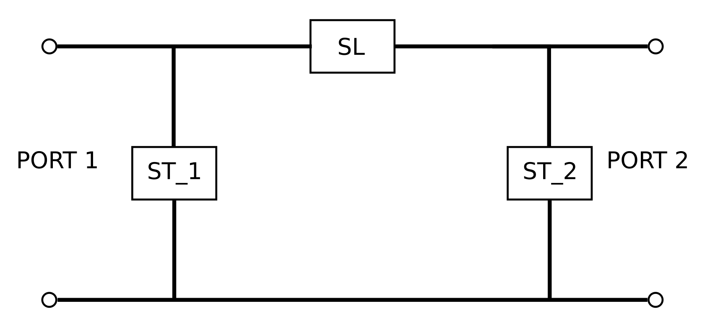
</p>

Returns

* S_Matrix : *S_Matrix* <br>
2-port *S_Matrix*, of the PI-network defined over the same frequency values over which ST_1, ST_2 and SL are defined. The impedances of the two ports are specified by the relevant method parameter

#### `sMatrixTrLine(cls, l, freqs, z0_line=50, c_f = 1, alpha=0, z0=50)`

*class method* used to return an *S_Matrix* of a low-losses transmission line.

Parameters

* cls : *S_Matrix* class <br>
* l : *float* <br>
length, in meters, of the transmission line
* freqs : *list*, *numpy ndarray*<br>
*list*, *numpy ndarray* reporting the frequency values, in hertz, over which the returned *S_Matrix* is defined
* z0_line : *int*, *float*, *optional* <br>
characteristic impedance, in ohm, of the transmission line. Default is 50 ohm
* c_f : *float*, *optional* <br
ratio between the propagation velocity in the transmission line and the speed of light. Default is 1
* alpha : *float*, *optional* <br>
attenuating coefficient of the transmission line. Default is 0
* z0 : *int*, *float*, *list*, *numpy ndarray*, *optional* <br>
port impedances. These can be given as a 2-element *list* or *numpy ndarray*. If all the ports share the same impedance value, an *int* or *float* value can be passed as parameter. Default is 50 ohm

Returns

* S_Matrix : *S_Matrix* <br>
2-port *S_Matrix*, of the transmission line defined over the frequency values given as method parameter. The impedances of the two ports are equal to the characteristic impedance of the transmission line given as method parameter

#### `sMatrixDoubleY(cls,freqs, z0_1stPort=50)`

*class method* used to return an *S_Matrix* of a 3-port Y-like network. All the network ports shared the same port impedance.

Parameters

* cls : *S_Matrix* class <br>
* freqs : *list*, *numpy ndarray*<br>
*list*, *numpy ndarray* reporting the frequency values, in hertz, over which the returned *S_Matrix* is defined
* z0 : *int*, *float*, *optional*<br>
port impoedances. Default is 50 ohm

<p align="center">
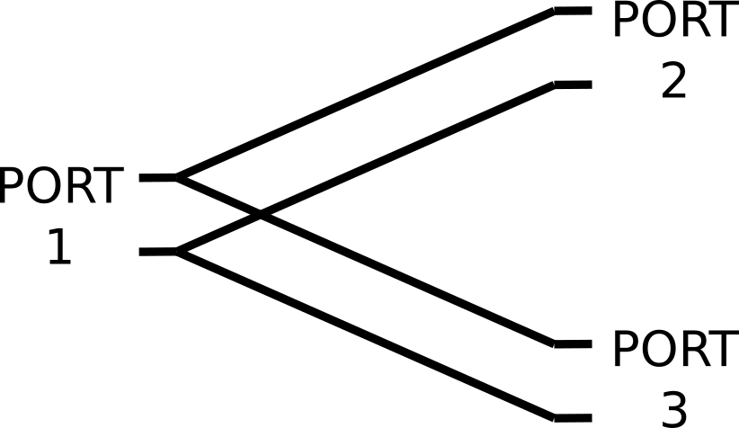
</p>

Returns

* S_Matrix : *S_Matrix* <br>
3-port *S_Matrix*, of the Y-like network defined over the frequency values listed in freqs. The impedances of the three ports are equal to those specified by the relevan method parameter

#### `sMatrixDoubleE(cls,freqs, z0_1stPort=50)`

*class method* used to return an *S_Matrix* of a 3-port E-like network. All the network ports shared the same port impedance.

Parameters

* cls : *S_Matrix* class <br>
* freqs : *list*, *numpy ndarray*<br>
*list*, *numpy ndarray* reporting the frequency values, in hertz, over which the returned *S_Matrix* is defined
* z0 : *int*, *float*, *optional*<br>
port impoedances. Default is 50 ohm

<p align="center">
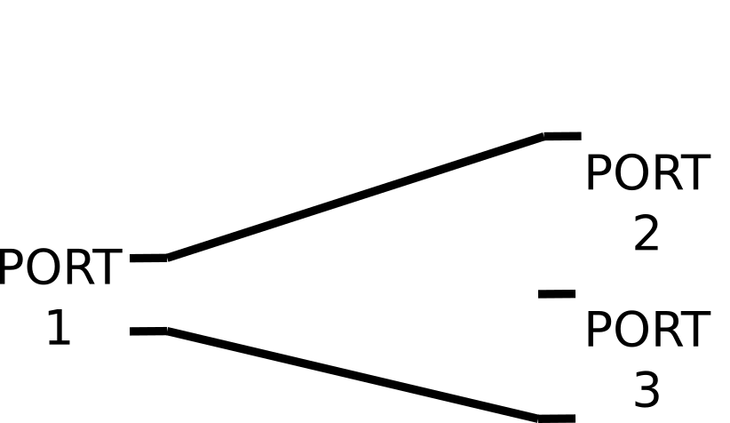
</p>

Returns

* S_Matrix : *S_Matrix* <br>
3-port *S_Matrix*, of the E-like network defined over the frequency values listed in freqs. The impedances of the three ports are equal to those specified by the relevan method parameter

#### `__movePort(cls, Smat, idx0, idx1)`

private *class method* used to return an *S_Matrix* where the `Smat` port at index `idx0` is exchanged with the port at index `idx1`.

Parameters

* cls : *S_Matrix* class <br>
* Smat : *S_Matrix* <br>
* idx0 : *int*<br>
start point index. It can be included in the range 0 to (N<sub>P</sub>-1) where N<sub>P</sub> is the number of ports of `Smat`. The index can be also included in the range -N<sub>P</sub> to -1. In the last case `idx0 += N_P`
* idx1 : *int*<br>
end point index. It can be included in the range 0 to (N<sub>P</sub>-1) where N<sub>P</sub> is the number of ports of `Smat`. The index can be also included in the range -N<sub>P</sub> to -1. In the last case `idx1 += N_P`

Returns

* S_Matrix : *S_Matrix* <br>
*S_Matrix* where the `Smat` port at index `idx0` is exchanged with the port at index `idx1`. If `idx0 < idx1` it moves the port at `idx0` of `Smat` after the port at `idx1` of `Smat`. If `idx0 > idx1` it moves the port at `idx0` of `Smat` before the port at `idx1` of `Smat` <br>
If: <br>
`Smat_t = movePort(Smat, idx0, idx1)` <br>
it is always verified: <br>
`Smat == movePort(Smat_t, idx1, idx0)` <br>
___
## EM_Field class
This class is defined to manage harmonic electric and magnetic flux density fields generated by any multiport device.
The EM field must be computed on a regular cartesian grid (&Delta;x = &Delta;y = &Delta;z).

### Properties
* `EM_Field.b_field` : *numpy ndarray* or *None* <br>
N<sub>f</sub> 🞩 N<sub>P</sub> 🞩 3 🞩 N<sub>N</sub> *numpy ndarray* where N<sub>f</sub> is the number of frequency values over which the magnetic flux density field, expressed in tesla, is defined. N<sub>P</sub> is the number of ports of the device and N<sub>N</sub> is the number of spatial points over which the magnetic flux density field is defined. `EM_Field.b_field[i,k,j,n]` represents the rms of the `j` component of the magnetic flux density field at the frequency identified by the index `i`, when the port `k` is supplied with 1 W incident power in the point identified by index `n`. The values along the last axis of the array follow a fortran-like index ordering (first index changing faster)  considering a Cartesian coordinate system. It can be `None` if the magnetic flux density field is not defined.
* `EM_Field.e_field` : *numpy ndarray* or *None* <br>
N<sub>f</sub> 🞩 N<sub>P</sub> 🞩 3 🞩 N<sub>N</sub> *numpy ndarray* where N<sub>f</sub> is the number of frequency values over which the electric field, expressed in volts per meter, is defined. N<sub>P</sub> is the number of ports of the device and N<sub>N</sub> is the number of spatial points over which the electric field is defined. `EM_Field.e_field[i,k,j,n]` represents the rms of the `j` component of the electric field at the frequency identified by the index `i`, when the port `k` is supplied with 1 W incident power in the point identified by index `n`. The values along the last axis of the array follow a fortran-like index ordering (first index changing faster) considering a Cartesian coordinate system. It can be `None` if the electric field is not defined.
* `EM_Field.frequencies` : *numpy ndarray* <br>
N<sub>f</sub> *numpy ndarray* representing the frequency values, in hertz, over which electric and magnetic flux density fields are defined
* `EM_Field.nPoints` : *numpy ndarray* <br>
*numpy ndarray* with a length equal to three reporting the number of spatial points over which the electric and magnetic flux density fields are defined: [N<sub>x</sub>, N<sub>y</sub>, N<sub>z</sub>]
* `EM_Field.n_f` : *int* <br>
number of frequency values over which the electric and magnetic flux density fields are defined (N<sub>f</sub>)
* `EM_Field.nPorts` : *int* <br>
number of ports associated with the electric and magnetic flux density fields (N<sub>P</sub>)
* `EM_Field.properties` : *dict* <br>
*dictionary* which include additional properties related to the points on which the electric and magnetic flux density fields are defined. These can be, for example, the electric permittivity and electrical conductivity. Refer to the `EM_Field.__init__` method for further details about the way this dictionary has to be defined.

### Methods

#### `__init__(self, freqs, nPoints, b_field=None, e_field=None, props={})`

It creates an *EM_Field* instance. At least one among b_field and e_field must be different from `None`

Parameters

* freqs : *list* or *numpy ndarray* <br>
N<sub>f</sub> *list* or *numpy ndarray* representing the frequency values, in hertz, over which the electric and magnetic flux density fields are defined
* nPoints : *list* or *numpy ndarray* <br>
*list* or *numpy ndarray* with a length equal to three reporting the number of spatial points over which the electric and magnetic flux density fields are defined: [N<sub>x</sub>, N<sub>y</sub>, N<sub>z</sub>]
* b_field : *numpy ndarray*, *optional* <br>
N<sub>f</sub> 🞩 N<sub>P</sub> 🞩 3 🞩 N<sub>N</sub> *numpy ndarray* where N<sub>f</sub> is the number of frequency values over which the magnetic flux density field, expressed in tesla, is defined. N<sub>P</sub> is the number of ports of the device and N<sub>N</sub> is the number of spatial points over which the magnetic flux density field is defined. `b_field[i,k,j,n]` represents the rms of the `j` component of the magnetic flux density field at the frequency identified by the index `i`, when the port `k` is supplied with 1 W incident power in the point identified by index `n`. The values along the last axis of the array follow a fortran-like index ordering (first index changing faster) considering a Cartesian coordinate system. It can be `None` (default value) if the magnetic flux density field is not defined
* e_field : *numpy ndarray*, *optional* <br>
N<sub>f</sub> 🞩 N<sub>P</sub> 🞩 3 🞩 N<sub>N</sub> *numpy ndarray* where N<sub>f</sub> is the number of frequency values over which the electric field, expressed in volts per meter, is defined. N<sub>P</sub> is the number of ports of the device and N<sub>N</sub> is the number of spatial points over which the electric field is defined. `EM_Field.e_field[i,k,j,n]` represents the rms of the `j` component of the electric field at the frequency identified by the index `i`, when the port `k` is supplied with 1 W incident power in the point identified by index `n`. The values along the last axis of the array follow a fortran-like index ordering (first index changing faster)  considering a Cartesian coordinate system. It can be `None` (default value) if the electric field is not defined
* props : *dict*, *optional* <br>
additional properties defined over the same N<sub>N</sub> spatial points over which the electric and magnetic flux density fields are defined. The `props` dictionary has to be composed in the following way:
  - A `idxs` key has to be present. `props['idxs']` is a N<sub>N</sub> *list* or *numpy ndarray* of integer numbers representing the indeces of the specific points. The indices have to start from zero and no integer number has to be skipped from zero to the maximum index value. The values in the array follow a fortran-like index ordering (first index changing faster) considering a Cartesian coordinate system.
  - Any other key has to refer to a *list* or *numpy ndarray* with a legth equal to the maximum index contained in `props['idxs']` plus one. The property `props['prop_1'][idx]` is the 'prop_1' property relevant to all the spatial points identified by an index equal to idx in `props['idxs']`

  Default is *{}*

Returns

* EM_Field : *EM_Field*

Example
```python
import numpy as np
from cosimpy import *

n_p = 5 #Number of ports
n_f = 10 #Number of frequency values
nPoints = [3,4,5] #Number of points along the three Cartesian directions

frequencies = np.linspace(50e6, 150e6, n_f, endpoint=False))

bfield = np.random.rand(n_f,n_p,3,np.prod(nPoints)) + 1j*np.random.rand(n_f,n_p,3,np.prod(nPoints))

cond = np.random.uniform(size=np.prod(nPoints))

EM_Field(frequencies, nPoints, b_field=bfield, conductivity=cond)

'''
Out:

    """""""""""""""
        EM FIELD
    """""""""""""""

    Number of frequency values = 10
    Number of ports = 5
    Number of points (nx, ny, nz) = 3, 4, 5

    E field not defined

    'conductivity' additional property defined

'''
```

#### `__repr__(self)`

Method for returning a printable representation of the *EM_Field* instance.

Parameters

* self : *EM_Field*
  
Returns

* string : *string* <br>
The string identifies the class of the instance. It reports the number of frequency values, the number of ports and the number of spatial points over which the EM field is defined

#### `__getitem__(self, key)`

Indexing method for *EM_Field* instances. Indices are interpreted as frequency values.

Parameters

* self : *EM_Field*
* key : *tuple*, *list*, *numpy ndarray*, *int*, *float*, *slice* <br>
frequency values used to index the `self` *EM_Field*

Returns

* EM_Field : *EM_Field*

Example
```python
import numpy as np
from cosimpy import *

n_p = 5 #Number of ports
n_f = 10 #Number of frequency values 
n_points = [10,10,10] #Number of points

frequencies = np.linspace(50e6, 150e6, n_f, endpoint=False)

e_field = np.random.random(size=(n_f,n_p,3,np.prod(n_points))) + 1j*np.random.random(size=(n_f,n_p,3,np.prod(n_points)))
b_field = None

em_field = EM_Field(frequencies, n_points, b_field, e_field)

em_field.frequencies

'''
Out:

    array([5.0e+07, 6.0e+07, 7.0e+07, 8.0e+07, 9.0e+07, 1.0e+08, 1.1e+08,
       1.2e+08, 1.3e+08, 1.4e+08])
'''

em_field[90e6:].frequencies

'''
Out:

    array([9.0e+07, 1.0e+08, 1.1e+08, 1.2e+08, 1.3e+08, 1.4e+08])
'''

em_field[90e6:130e6].frequencies

'''
Out:

    array([9.0e+07, 1.0e+08, 1.1e+08, 1.2e+08])
'''
em_field[95e6].frequencies

'''
Out:

'WARNING: 9.500000e+07 Hz is not contained in the frequencies list. 9.000000e+07 Hz is returned instead'
    array([90000000.])

'''
```


#### `getProperty(self, prop_key)`

The method returns the `self.properties[prop_key]` distribution in the voxels where the EM field is defined.

Parameters

* self : *EM_Field* <br>
* prop_key : *string*, <br>
*string* matching the key inside the `self.properties` dictionary and referring to the property that is wanted to be extracted

Returns

* property : *numpy ndarray* <br>
1D *numpy ndarray* containing the value of the requested property in each voxel. The values in the array follow a fortran-like index ordering (first index changing faster) considering a Cartesian coordinate system.


#### `addProperty(self, prop_key, prop_value)`

Method to be used to add a property to the `self.properties` dictionary.

Parameters

* self : *EM_Field* <br>
* prop_key : *string* <br>
*string* identifying the property name
* prop_value : *list*, *numpy ndarray* <br>
*list* or *numpy ndarray* relevant to the property that is wanted to be added to the `self.properties` dictionary of the EM_Field instance. The length of the array has to follow the rules specified for the `self.properties` dictionary keys (see `__init__` method) 

Returns

* None


#### `maskEMField(self, idx)`

The method can be used to set to NaN the EM field values in the voxels where the `properties[""idxs"]` is equal to `idx`

Parameters

* self : *EM_Field* <br>
* idx : *int* <br>
integer value representing the index where the EM field values are wanted to be NaN. Its value refers to the index values declared in the `self.properties` dictionary

Returns

* None


#### `compSensitivities(self)`

If the magnetic flux density field is defined, the method returns the complex B<sub>1</sub><sup>+</sup> and B<sub>1</sub><sup>-</sup> values according to the following expressions:
$$B_1^+=\frac{B_x+jB_y}{2}\quad B_1^-=\frac{(B_x-jB_y)^*}{2}$$

Parameters

* self : *EM_Field*
  
Returns

* sens : *numpy ndarray* <br>
N<sub>f</sub> 🞩 N<sub>P</sub> 🞩 2 🞩 N<sub>N</sub> *numpy ndarray* where N<sub>f</sub> is the number of frequency values over which the sensitivity, expressed in tesla, are defined. N<sub>P</sub> is the number of ports of the device and N<sub>N</sub> is the number of spatial points over which the sensitivities are defined. `sens[i,k,j,n]` represents the B<sub>1</sub><sup>+</sup> (if j is equal to 0) or B<sub>1</sub><sup>-</sup> (if j is equal to 1) complex value at the frequency identified by the index i, generated by 1 W incident power at port k in the point identified by index n. The values along the last axis of the array follow a fortran-like index ordering (first index changing faster) considering a Cartesian coordinate system

#### `compPowDens(self, elCond_key, p_inc=None)`

If the electric field is defined, the method returns the power density in W/m<sup>3</sup>.

Parameters

* self : *EM_Field*
* elCond_key : *string*<br>
*string* of the key in the `self.properties` dictionary associated with the electrical conductivity
* p_inc : *list*, *numpy ndarray*, *optional*<br>
*list* or *numpy ndarray* with a length equal to the number of ports of the device. `p_inc[i]` is the power incident to the i-th port considered for the power density computation. Default is `None`

Returns

* powDens : *numpy ndarray* <br>
if p_inc is `None`: N<sub>f</sub> 🞩 N<sub>P</sub> x N<sub>N</sub> *numpy ndarray* where N<sub>f</sub> is the number of frequency values over which the power density, expressed in W/m<sup>3</sup>, is defined. N<sub>P</sub> is the number of ports of the device and N<sub>N</sub> is the number of spatial points over which the power density is defined. `powDens[i,k,n]` represents the power density at the frequency identified by the index i, generated by 1 W incident power at port k with all the other ports closed over their characteristic impedance, in the point identified by index n. The values along the last axis of the array follow a Fortran-like index ordering (first index changing faster) considering a Cartesian coordinate system. If p_inc is not `None`: N<sub>f</sub> x N<sub>N</sub> *numpy ndarray* where the power density is computed in the N<sub>N</sub> spatial points at the N<sub>f</sub> frequency values when the device is supplied according to the p_inc list passed as argument to the method

#### `compDepPow(self, voxVols, elCond_key, p_inc=None)`

If the electric field is defined, the method returns the power, in watt, deposited in the voxels over which the electric field is defined

Parameters

* self : *EM_Field*
* voxVols : *int*, *float*<br>
volume, in m<sup>3</sup>, of each voxel over which the electric field has been defined
* elCond_key : *string*<br>
*string* of the key in the `self.properties` dictionary associated with the electrical conductivity
* p_inc : *list*, *numpy ndarray*, *optional*<br>
*list* or *numpy ndarray* with a length equal to the number of ports of the device. p_inc[i] is the power incident to the i-th port considered for the power density computation. Default is `None`

Returns

* depPow : *numpy ndarray* <br>
if p_inc is `None`: N<sub>f</sub> 🞩 N<sub>P</sub> *numpy ndarray* where N<sub>f</sub> is the number of frequency values over which the deposited power, expressed in watt, is defined and N<sub>P</sub> is the number of ports of the device. `depPow[i,k]` represents the deposited power at the frequency identified by the index i, generated by 1 W incident power at port k with all the other ports closed over their characteristic impedance. If p_inc is not `None`: N<sub>f</sub> *numpy ndarray* where the deposited power is computed at the N<sub>f</sub> frequency values when the device is supplied according to the p_inc list passed as argument to the method

#### `spatialAverageSAR(self, targetMass, voxVols, elCond_key, massDensity_key, p_inc, freq, step1_libPath, step2_libPath, backgroundIdx = None, additionalBackground=[0,0,0])`

If the electric field is defined, the method returns the spatial averaged SAR according to the procedure outlined in the IEC/IEEE 62704-1 standard *Determining the peak spatial-average specific absorption rate (SAR) in the human body from wireless communications devices, 30 MHz to 6 GHz – Part 1: General requirements for using the finite-difference time-domain (FDTD) method for SAR calculations*. The method is based on the implementation available [here](https://github.com/umbertozanovello/IEC-IEEE-62704-1-spatial-average-SAR). In particular, it requires two libraries whose path has to be passed as argument to the method.

Parameters

* self : *EM_Field*
* targetMass : *int*, *float*<br>
averaging mass in kg
* voxVols : *int*, *float*<br>
volume, in m<sup>3</sup>, of each voxel over which the electric field has been defined
* elCond_key : *string*<br>
*string* of the key in the `self.properties` dictionary associated with the electrical conductivity in S/m
* massDensity_key : *string*<br>
*string* of the key in the `self.properties` dictionary associated with the mass density in Kg/m<sup>3</sup>
* p_inc : *list*, *numpy ndarray*<br>
*list* or *numpy ndarray* with a length equal to the number of ports of the device. p_inc[i] is the power incident to the i-th port considered for the power density computation averaged by the algorithm
* freq : *int*, *float* <br>
frequency value at which the Q matrix is evaluated. The value has to be included in the `self.frequencies` array
* step1_libPath : *string*<br>
path of the shared library containing the functions for performing the Step 1 of the spatial average SAR procedure. Check [here](https://github.com/umbertozanovello/IEC-IEEE-62704-1-spatial-average-SAR) for more information 
* step2_libPath : *string*<br>
path of the shared library containing the functions for performing the Step 2 of the spatial average SAR procedure. Check [here](https://github.com/umbertozanovello/IEC-IEEE-62704-1-spatial-average-SAR) for more information 
* backgroundIdx : *int*, *optional*<br>
Index of the background voxels in the domain according to the "idxs" key in the `self.properties` dictionary. Default is `None`
* additionalBackground : *list*, *numpy ndarray*, *optional*
three element list indicating the additional background voxels to be added for computation along the x,y,z directions. Default is `[0,0,0]`

Returns

* avgSARArray : *numpy ndarray*<br>
1D numpy ndarray cntaining the spatial average SAR values in the N<sub>N</sub> points of the domain. The values follow a Fortran-like index ordering (first index changing faster) considering a Cartesian coordinate system.

* voxStatusArray : *numpy ndarray*<br>
1D numpy ndarray containing the flag values in the N<sub>N</sub> points of the domain. The values follow a Fortran-like index ordering (first index changing faster) considering a Cartesian coordinate system. The following definition is used (see IEC/IEEE 62704-1 standard for further information):
    * 0 : INVALID (background)
    * 1 : UNUSED
    * 2 : USED
    * 3 : VALID

#### `compQMatrix(self, point, freq, z0_ports, elCond_key=None)`

If the electric field is defined, the method returns the Q matrix referred to the specified spatial point.

<center>PD = V<sup>+<sup>H</sup></sup> Q V<sup>+</sup></center>

where PD is the power density in the specified spatial point (W/m<sup>3)</sup>, V<sup>+</sup> is the vector of the voltages incident to the device ports and H is conjugate transpose.

Parameters

* self : *EM_Field*
* point : *list*, *numpy ndarray* <br>
three element *list* or *numpy ndarray* used to specify the spatial position where the Q matrix points
* freq : *int*, *float* <br>
frequency value at which the Q matrix is evaluated. The value has to be included in the `self.frequencies` array
* z0_ports *list*, *numpy ndarray*, *int*, *float*, *optional* <br>
port impedances in ohm. These can be given as a *list* or *numpy ndarray* with length equal to the number of ports of the device. If all the ports share the same impedances, a *float* or *int* value can be passed as parameter. The format is compatible with that of the *S_Matrix* property `z0`. Default is 50 ohm
* elCond_key : *string*, *optional*<br>
*string* of the key in the `self.properties` dictionary associated with the electrical conductivity. If `None`, the Q matrix is reported for unit conductivity. Default is `None`

Returns

* q_matrix : *numpy ndarray* <br>
N<sub>P</sub> 🞩 N<sub>P</sub> *numpy ndarray*, being N<sub>P</sub> the number of ports of the device, representative of the Q matrix computed in the specified point. If the "elCond" argument is `None` and no "elCond" property is found among the **kwargs of the class, the Q matrix is relevant to 1 S/m electrical conductivity


#### `compVOP(self, freq, u_max_r, z0_ports=50, elCond_key=None, avg_rad=1)`

If the electric field is defined, the method computes the Virtual Observation Points according to the procedure proposed in the paper "Eichfelder G, Gebhardt M. Local specific absorption rate control for parallel transmission by virtual observation points. Magn Reson Med. 2011 Nov;66(5):1468-76. doi: 10.1002/mrm.22927" 

Parameters

* self : *EM_Field*
* freq : *int*, *float* <br>
frequency value at which the Q matrix is evaluated. The value has to be included in the `self.frequencies` array
* u_max_r : *float* <br>
the ratio between the maximum allowed overestimation of the SAR using the VOP with respect to the actual highest SAR in the domain obtained for the worst supply combination
* z0_ports *list*, *numpy ndarray*, *int*, *float*, *optional* <br>
port impedances in ohm. These can be given as a *list* or *numpy ndarray* with length equal to the number of ports of the device. If all the ports share the same impedances, a *float* or *int* value can be passed as parameter. The format is compatible with that of the *S_Matrix* property `z0`. Default is 50 ohm
* elCond_key : *string*, *optional*<br>
*string* of the key in the `self.properties` dictionary associated with the electrical conductivity. If `None`, the VOP matrices are reported for unit conductivity. Default is `None`
* avg_rad : *int*, *float*, *optional* <br>
if higher than 1, it performs a spherical average before computing the VOPs. Each voxel is therefore associated with a SAR matrix which is the average of the SAR matrices of the sorrounding voxels enclosed by a sphere centered on the first voxel. *avg_rad* defines the length of the radius of the sphere in number of voxels. Default is 1

Returns

* A_mats : *numpy ndarray* <br>
N<sub>cl</sub> 🞩 N<sub>P</sub> 🞩 N<sub>P</sub> *numpy ndarray*, being N<sub>cl</sub> the number of identified clusters and N<sub>P</sub> the number of ports of the RF coil.
* cluster_array : *numpy ndarray* <br>
1D N<sub>pnt</sub> array where N<sub>pnt</sub> is the number of points (voxels) in which the electric field has been defined. The values in the array follow a fortran-like index ordering (first index changing faster) considering a Cartesian coordinate system. `cluster_array[i] ` represents the cluster number (from 0) of the i-th voxel


#### `plotProperty(self, prop_key, plane, sliceIdx, vmin=None, vmax=None)`

Method for plotting the magnetic flux density field over a specific slice

<p align="center">
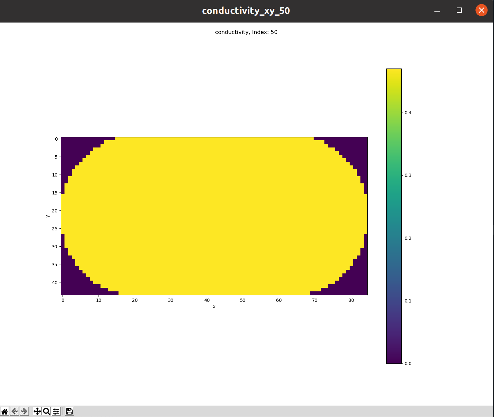
</p>

Parameters

* self : *EM_Field* <br>
* prop_key : *string*, <br>
*string* matching the key inside the `self.properties` dictionary and referring to the property that is wanted to be extracted
* plane : *string* <br>
slice to be plotted. It can take the following values:
  * 'xy' : axial slice
  * 'xz' : coronal slice
  * 'yz' : sagittal slice
* sliceIdx : *int* <br>
index of the slice to be plotted. It can take negative values. In that case `sliceIdx = Ns + sliceIdx` where Ns is the total number of slices in the relevant direction
* vmin *float*, *optional* <br>
minimum value of the chromatic bar. Default is `None` 
* vmax *float*, *optional* <br>
maximum value of the chromatic bar. Default is `None` 

Returns

* fig : *matplotlib.figure.Figure* <br>
instance of *matplotlib.figure.Figure* relevant to the produced plot


#### `plotEMField(self, em_field, comp, freq, ports, plane, sliceIdx, vmin=None, vmax=None)`

Method for plotting the magnetic flux density field over a specific slice

<p align="center">
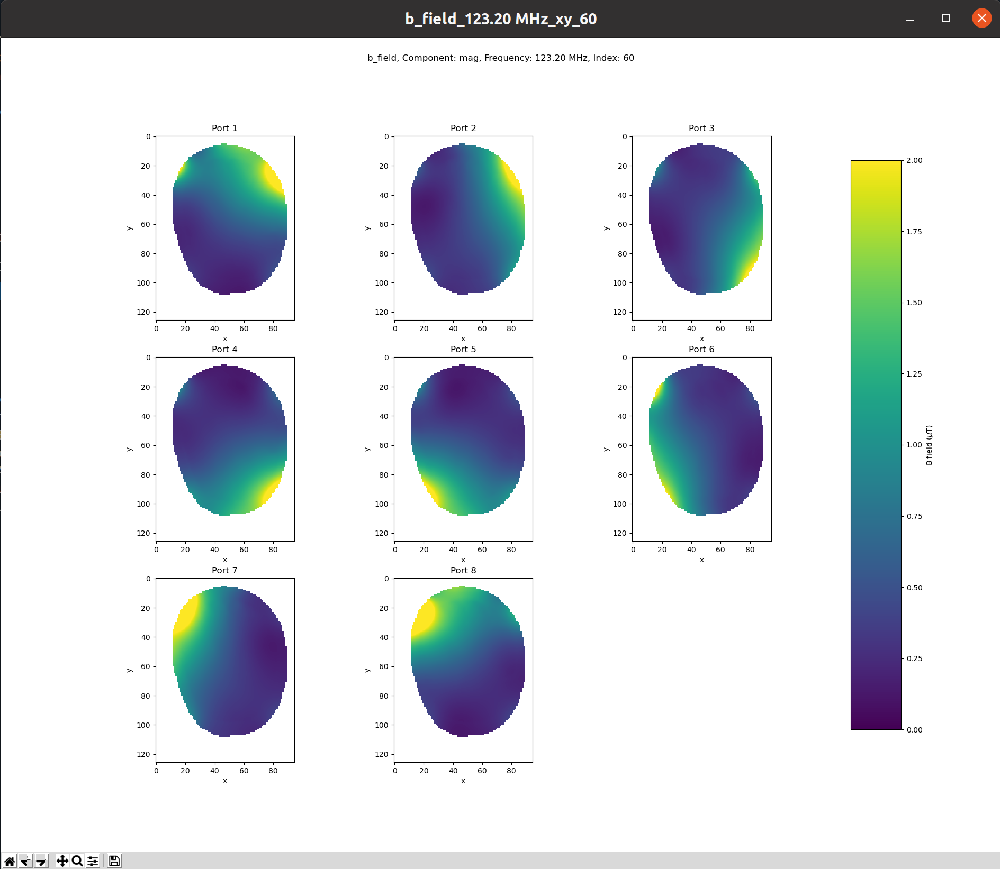
</p>

Parameters

* self : *EM_Field* <br>
* em_field : *string* <br>
*string* used to identify the EM field type to be plotted. Accepted values are "e_field" for the electric field and "b_field" for the magentic flux density
* comp : *string* <br>
component of the magnetic flux density field to be plotted. It can take the following values:
  * 'x' : x-component
  * 'y' : y-component
  * 'z' : z-component
  * 'mag' : magnitude of the magnetic flux density field vector (rms value)
  * 'b1+' : magnitude of B<sub>1</sub><sup>+</sup> (accepted only if `em_field="b_field"`)
  * 'b1-' : magnitude of B<sub>1</sub><sup>-</sup> (accepted only if `em_field="b_field"`)
* freq : *float* <br>
frequency, in hertz, of the magnetic flux density field to be plotted
* ports : *list*, *numpy ndarray* <br>
*list* or *numpy ndarray* of the port numbers whose EM field has to be plotted. Each entry, can take values from 1 to N<sub>P</sub> being N<sub>P</sub> the number of ports of the device
* plane : *string* <br>
slice to be plotted. It can take the following values:
  * 'xy' : axial slice
  * 'xz' : coronal slice
  * 'yz' : sagittal slice
* sliceIdx : *int* <br>
index of the slice to be plotted. It can take negative values. In that case `sliceIdx = Ns + sliceIdx` where Ns is the total number of slices in the relevant direction
* vmin *float*, *optional* <br>
minimum value (in microtesla if `em_field='b_field'`) of the chromatic bar. Default is `None` 
* vmax *float*, *optional* <br>
maximum value (in microtesla if `em_field='b_field'`) of the chromatic bar. Default is `None` 

Returns

* fig : *matplotlib.figure.Figure* <br>
instance of *matplotlib.figure.Figure* relevant to the produced plot

#### `exportXMF(self, filename)`

Method for generating a .xmf and a .h5 file to be imported in data analysis and visualization applications such as [ParaView](https://www.paraview.org/). In the .h5 files, the electric field and magnetic flux density field are stored as <f\>MHz-p<n\>-<F\>_<type\> where <f\> is the frequency value in megahertz, <n\> is the port number, <F\> is 'E' (electric field) or 'B' (magnetic flux density field) and <type\> can be 'real' or 'imag' identifying the real or imaginary part of the field phasor. Additional properties, defined along the *EM_Field* instance, are stored with their full name in the .h5 file.

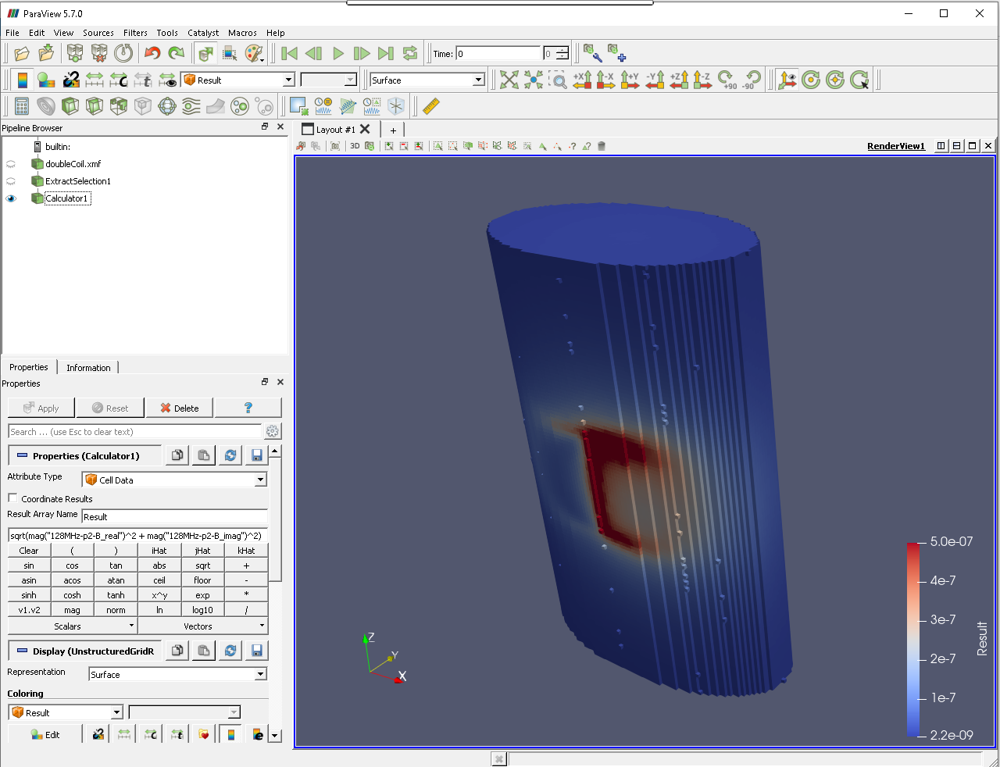

Parameters

* self : *EM_Field*
* filename : *string* <br>
name of the .xmf and .h5 files

Returns

* None

#### `_newFieldComp(self, p_inc, phase)`

It returns an *EM_Field* instance where the EM fields are updated according to new incident powers whose magnitude and 'phase' are contained in `p_inc` and `phase` *numpy ndarray*

Parameters

* self : *EM_Field*
* p_incM : *numpy ndarray* <br>
N<sub>f</sub> 🞩 N<sub>Pout</sub> 🞩 N<sub>P</sub> *numpy ndarray* where N<sub>f</sub> is the number of frequency values over which `self` is defined, N<sub>Pout</sub> is the number of ports of the returned *EM_Field* instance and N<sub>P</sub> is the number of ports of `self`. 
PincM[i,j,k] represents the magnitude of the incident power at the k-port of `self` when the j-port of the output *EM_Field* is supplied with 1 W incident power at a frequency equal to `self.frequencies[i]`
* phaseM : *numpy ndarray* <br>
N<sub>f</sub> 🞩 N<sub>Pout</sub> 🞩 N<sub>P</sub> *numpy ndarray* where N<sub>f</sub> is the number of frequency values over which `self` is defined, N<sub>Pout</sub> is the number of ports of the returned *EM_Field* instance and N<sub>P</sub> is the number of ports of `self`. 
PincM[i,j,k] represents the magnitude of the incident power at the k-port of `self` when the j-port of the output *EM_Field* is supplied with 1 W incident power at a frequency equal to `self.frequencies[i]`

Returns

* EM_Field : *EM_Field* <br>
*EM_Field* defined over the same frequency values of `self` *EM_Field*. The returned *EM_Field* is characterised by N<sub>Pout</sub> different distributions of EM fields corresponding to the number of rows of `p_incM` and `phaseM` method parameters

#### `importFields_cst(directory, freqUnit="MHz", eFieldRefString="efield_<f>_port<p>.fld", bFieldRefString="bfield_<f>_port<p>.fld", nPoints=None, Pinc_ref=1, b_multCoeff=1, pkORrms='pk', imp_efield=True, imp_bfield=True, fileType = 'ascii', col_ascii_order = 0, props={})`

class method which returns an *EM_Field* instance importing the data from [CST<sup>®</sup> STUDIO SUITE](https://www.3ds.com/products-services/simulia/products/cst-studio-suite/) standard ASCII of HDF5 export files.<br>
RResults files must be collected in a dedicated directory and named accordingly to the `eFieldRefString` and `bFieldRefString` for the electric field and magnetic flux density, respectively. All the EM quantities must be exported on the same regular grid.

Parameters

* directory : *string* <br>
*string* reporting the path of the directory which contains the text files
* freqUnit : *string*, *optional* <br>
*string* indicating the frequency unit taken from the filenames. Accepted values are 'Hz', 'kHz', 'MHz', 'GHz'. Default is 'MHz'
* eFieldRefString :  *string*, *optional* <br>
The reference string of the filenames containing the Electric field distributions. The reference string indicates where cosimpy should read the frequency and port information. The first is indicated by '\<f>' and the latter by \<p>. In the filenames, '\<f>' and '\<p>' are replaced by numbers and should be separated by at least one non-numeric character. For example, if the Electric field filenames are such as efield_128.0_port1.fld, the *eFieldRefString* will be equal to 'efield_\<f>_port\<p>.fld'. Default is 'efield_\<f>_port\<p>.fld'
* bFieldRefString :  *string*, *optional* <br>
The reference string of the filenames containing the Magnetic Flux Density distributions. The reference string indicates where cosimpy should read the frequency and port information. The first is indicated by '\<f>' and the latter by \<p>. In the filenames, '\<f>' and '\<p>' are replaced by numbers and should be separated by at least one non-numeric character. For example, if the Magnetic Flux Density filenames are such as bfield_128.0_port1.fld, the *bFieldRefString* will be equal to 'bfield_\<f>_port\<p>.fld'. Default is 'bfield_\<f>_port\<p>.fld'
* nPoints : *list*, *numpy ndarray*, *optional* <br>
*list* or *numpy ndarray* with a length equal to three reporting the number of spatial points over which the electric and magnetic flux density fields are defined: [N<sub>x</sub>, N<sub>y</sub>, N<sub>z</sub>]. If `None` (default value) the method deduces them from the result files at the expenses of a slight longer import process
* Pinc_ref : *float*, *optional* <br>
magnitude of the power incident at the ports which generate the EM fields.  Default is 1 W.
* b_multCoeff : *float*, *optional* <br>
multiplicative factor for the magnetic results. In case the exported results are magnetic field values (A/m), it has to be equal to 4&pi;10<sup>-7</sup> to obtain magnetic flux density values in tesla. Default is 1
* pkORrms : *string*, *optional* <br>
if 'pk' the values contained in the result files are interpreted as peak values, if 'rms' they are interpreted as rms values. Default is 'pk'
* imp_efield : *bool*, *optional* <br>
if `True` the method imports the results relevant to the electric field. Default is `True`
* imp_bfield : *bool*, *optional* <br>
if `True` the method imports the results relevant to the magnetic flux density field. Default default is "ascii"
* fileType : *string*, *optional* <br>
*string* identifying the type of files collecting the field data. It can be either "ascii" or "hdf5". Default is "ascii"
* col_ascii_order : *int*, *optional* <br>
*int* identifying the column order in the ascii files.<br>
if 0: |x, y, z, <EM\>xRe, <EM\>yRe, <EM\>zRe, <EM\>xIm, <EM\>yIm, <EM\>zIm|<br>
if 1: |x, y, z, <EM\>xRe, <EM\>xIm, <EM\>yRe, <EM\>yIm, <EM\>zRe, <EM\>zIm|<br>
If fileType = "hdf5" this argument is not considered. Default is 0
* props : *dictionary*, *optional* <br>
additional properties defined over the same N<sub>N</sub> spatial points over which the electric and magnetic flux density fields are defined. For further details see `EM_Field.__init__` method.<br>
Default is *{}*

Returns

* EM_Field : *EM_Field* <br>
*EM_Field* obtained from the EM results exported from CST<sup>®</sup> STUDIO SUITE. `EM_Field.properties` is a dictionary based on the `props` parameter passed to the method

#### `importFields_s4l(directory, freqs, nPorts, Pinc_ref=1, b_multCoeff=1, pkORrms='pk', imp_efield=True, imp_bfield=True, props={})`

class method which returns an *EM_Field* instance importing the data from [Sim4Life](https://zmt.swiss/sim4life/) standard export .mat files. Results files must be collected in a dedicated directory and named as <field_str>_port\<n>.mat where <field_str> can be either 'efield', for the electric field results, or 'bfield' for magnetic flux density field results and \<n> is the number of the ports supplied, in the simulation environment, to generate the relevant EM field. All the EM quantities must be exported on the same regular grid.

Parameters

* directory : *string* <br>
*string* reporting the path of the directory which contains the .mat files
* freqs : *list*, *numpy ndarray* <br>
*list* or *numpy ndarray* of *float* values reporting the sorted frequency values at which the results have been exported from Sim4Life
* nPorts : *int* <br>
number of ports for which the results are available
* nPoints : *list*, *numpy ndarray*, *optional* <br>
*list* or *numpy ndarray* with a length equal to three reporting the number of spatial points over which the electric and magnetic flux density fields are defined: [N<sub>x</sub>, N<sub>y</sub>, N<sub>z</sub>]. If `None` (default value) the method deduces them from the result files at the expenses of a slight longer import process
* Pinc_ref : *float*, *optional* <br>
magnitude of the power incident at the ports which generate the EM fields.  Default is 1 W.
* b_multCoeff : *float*, *optional* <br>
multiplicative factor for the magnetic results. In case the exported results are magnetic field values (A/m), it has to be equal to 4&pi;10<sup>-7</sup> to obtain magnetic flux density values in tesla. Default is 1
* pkORrms : *string*, *optional* <br>
if 'pk' the values contained in the result files are interpreted as peak values, if 'rms' they are interpreted as rms values. Default is 'pk'
* imp_efield : *bool*, *optional* <br>
if `True` the method imports the results relevant to the electric field. Default is `True`
* imp_bfield : *bool*, *optional* <br>
if `True` the method imports the results relevant to the magnetic flux density field. Default is `True`
* props : *dictionary*, *optional* <br>
additional properties defined over the same N<sub>N</sub> spatial points over which the electric and magnetic flux density fields are defined. For further details see `EM_Field.__init__` method.<br>
Default is *{}*

Returns

* EM_Field : *EM_Field* <br>
*EM_Field* obtained from the EM results exported from Sim4Life. `EM_Field.properties` is a dictionary based on the `props` parameter passed to the method

#### `importFields_hfss(directory, freqUnit="MHz", eFieldRefString="efield_<f>_port<p>.fld", bFieldRefString="bfield_<f>_port<p>.fld", nPoints=None, Pinc_ref=1, b_multCoeff=1, pkORrms='pk', imp_efield=True, imp_bfield=True, col_ascii_order = 1, props={})`

class method which returns an *EM_Field* instance importing the data from [Ansys HFSS<sup>®</sup> ](https://www.ansys.com/products/electronics/ansys-hfss) standard ASCII .fld files.<br>
Results files must be collected in a dedicated directory and named accordingly to the `eFieldRefString` and `bFieldRefString` for the electric field and magnetic flux density, respectively. All the EM quantities must be exported on the same regular grid.

Parameters

* directory : *string* <br>
*string* reporting the path of the directory which contains the text files
* freqUnit : *string*, *optional* <br>
*string* indicating the frequency unit taken from the filenames. Accepted values are 'Hz', 'kHz', 'MHz', 'GHz'. Default is 'MHz'
* eFieldRefString :  *string*, *optional* <br>
The reference string of the filenames containing the Electric field distributions. The reference string indicates where cosimpy should read the frequency and port information. The first is indicated by '\<f>' and the latter by \<p>. In the filenames, '\<f>' and '\<p>' are replaced by numbers and should be separated by at least one non-numeric character. For example, if the Electric field filenames are such as efield_128.0_port1.fld, the *eFieldRefString* will be equal to 'efield_\<f>_port\<p>.fld'. Default is 'efield_\<f>_port\<p>.fld'
* bFieldRefString :  *string*, *optional* <br>
The reference string of the filenames containing the Magnetic Flux Density distributions. The reference string indicates where cosimpy should read the frequency and port information. The first is indicated by '\<f>' and the latter by \<p>. In the filenames, '\<f>' and '\<p>' are replaced by numbers and should be separated by at least one non-numeric character. For example, if the Magnetic Flux Density filenames are such as bfield_128.0_port1.fld, the *bFieldRefString* will be equal to 'bfield_\<f>_port\<p>.fld'. Default is 'bfield_\<f>_port\<p>.fld'
* nPoints : *list*, *numpy ndarray*, *optional* <br>
*list* or *numpy ndarray* with a length equal to three reporting the number of spatial points over which the electric and magnetic flux density fields are defined: [N<sub>x</sub>, N<sub>y</sub>, N<sub>z</sub>]. If `None` (default value) the method deduces them from the result files at the expenses of a slight longer import process
* Pinc_ref : *float*, *optional* <br>
magnitude of the power incident at the ports which generate the EM fields.  Default is 1 W.
* b_multCoeff : *float*, *optional* <br>
multiplicative factor for the magnetic results. In case the exported results are magnetic field values (A/m), it has to be equal to 4&pi;10<sup>-7</sup> to obtain magnetic flux density values in tesla. Default is 1
* pkORrms : *string*, *optional* <br>
if 'pk' the values contained in the result files are interpreted as peak values, if 'rms' they are interpreted as rms values. Default is 'pk'
* imp_efield : *bool*, *optional* <br>
if `True` the method imports the results relevant to the electric field. Default is `True`
* imp_bfield : *bool*, *optional* <br>
if `True` the method imports the results relevant to the magnetic flux density field. Default default is "ascii"
* col_ascii_order : *int*, *optional* <br>
*int* identifying the column order in the ascii files.<br>
if 0: |x, y, z, <EM\>xRe, <EM\>yRe, <EM\>zRe, <EM\>xIm, <EM\>yIm, <EM\>zIm|<br>
if 1: |x, y, z, <EM\>xRe, <EM\>xIm, <EM\>yRe, <EM\>yIm, <EM\>zRe, <EM\>zIm|<br>
Default is 1
* props : *dictionary*, *optional* <br>
additional properties defined over the same N<sub>N</sub> spatial points over which the electric and magnetic flux density fields are defined. For further details see `EM_Field.__init__` method.<br>
Default is *{}*

Returns

* EM_Field : *EM_Field* <br>
*EM_Field* obtained from the EM results exported from Ansys HFSS<sup>®</sup>. `EM_Field.properties` is a dictionary based on the `props`parameter passed to the method

#### `__readPortFreqsFromFilenames(cls, directory, referenceString)`
Method for reading the frequency values and number of ports from the filenames following the sintax specified in `referenceString`
* directory : *string* <br>
*string* reporting the path of the directory which contains the text files
* referenceString : *string* <br>
The reference string of the filenames containing the information about the frequency values \<f> and port numbers \<p> (e.g., 'efield_\<f>_port\<p>.xx').

Returns

* freqs : *numpy ndarray* <br>
*numpy ndarray* of *float* values relevant to the frequency values extrapolated from the filenames
* n_ports : *int* <br>
The number of ports extrapolated from the filenames
* filenames : *numpy ndarray* <br>
*numpy ndarray* of *string* with size equal to N<sub>f</sub> x N<sub>p</sub> where N<sub>f</sub> is the number of frequency values and N<sub>p</sub> the number of ports. Each *string* represents a filename in `directory` that can be used by other methods to import the Electric Field or the Magnetic Flux Density.

___
## RF_Coil class
This class represents the link between the *S_Matrix* and *EM_Field* classes. An instance of this class represents the simulated device being, its properties, an *S_Matrix* and an *EM_Field* instance. The *S_Matrix* must be defined over all the frequency values at which the *EM_Field* is defined.

### Properties
* `RF_Coil.s_matrix` : *S_Matrix*<br>
*S_Matrix* instance defined over N<sub>f,s</sub> frequency values and with N<sub>P</sub> ports
* `RF_Coil.em_field` : *EM_Field*<br>
*EM_Field* instance defined over N<sub>f,em</sub> frequency values and with N<sub>P</sub> ports
* `RF_Coil.nPorts` : *int* <br>
number of ports associated with the RF coil (N<sub>P</sub>)

### Methods

#### `__init__(self, s_matrix, em_field=None)`

It creates an *RF_Coil* instance.

Parameters

* s_matrix : *S_Matrix*<br>
*S_Matrix* instance defined over N<sub>f,s</sub> frequency values and with N<sub>P</sub> ports
* em_field : *EM_Field*, optional<br>
*EM_Field* instance defined over N<sub>f,em</sub> frequency values and with N<sub>P</sub> ports. Default is `None`

Returns

* RF_Coil : *RF_Coil*

Example
```python
import numpy as np
from cosimpy import *

n_p = 5 #Number of ports
n_f = 10 #Number of frequency values
nPoints = [3,4,5] #Number of points for EM field along the three Cartesian directions

frequencies = np.linspace(50e6, 150e6, n_f, endpoint=False))

s_matrix = S_Matrix(np.random.uniform(size=(n_f,n_p,n_p)), freqs=frequencies)

bfield = np.random.rand(n_f,n_p,3,np.prod(nPoints))

em_field = EM_Field(frequencies, nPoints, b_field=bfield)

'''
Out:

    """""""""""""""
        RF COIL
    """""""""""""""


"""""""""""""""
   S MATRIX
"""""""""""""""

|V-| = |S||V+|
|5 x 1| = |5 x 5||5 x 1|

Number of frequency values = 10

"""""""""""""""
   EM FIELD
"""""""""""""""

Number of frequency values = 10

Number of points = (3, 4, 5)

E field not defined

'''
```

#### `__repr__(self)`

Method for returning a printable representation of the *RF_Coil* instance.

Parameters

* self : *RF_Coil*
  
Returns

* string : *string* <br>
The string identifies the class of the instance. It reports information about the *S_Matrix* and *EM_Field* properties

#### `singlePortConnRFcoil(self, networks, comp_Pinc=False)`

The method performs the cascade connection between `self` and the *S_Matrix* instances contained in `networks` *list*. 

Parameters

* self : *RF_Coil*
* networks : *list* <br>
*list* with length equal to the number of port of `self.s_matrix` either containing `None` values or *S_Matrix* instances defined over the same frequency values of `self.s_matrix`. If the n-th element of `networks` is `None`, the n-th port of `self` is not connected to any other network in the returned *RF_Coil*. If the n-th element of `networks` is an N-ports *S_Matrix*, its first port must share the same impedance of the n-th port of `self` and the two ports are connected together. In the returned *RF_Coil*, the n-th port of `self` is therefore expanded into (N-ports - 1) ports. The example proposed in the image below should clarify the workflow

<p align="center">

</p>

* comp_Pinc : *bool*, *optional* <br>
if `True` and the `self.em_field` property is not `None`, the method returns an *RF_Coil* instance whose `em_field` property is updated according to the new connections. If the `self.em_field` property is `None`, the `em_field` property of the returned *RF_Coil* is `None` but connection data are stored in the new *RF_Coil*. If `False` (default value), the `em_field` property of the returned *RF_Coil* is `None` and no connection data are stored

Returns

* RF_Coil : *RF_Coil* <br>
The new *RF_Coil* resulting form the connection of the original `self` *RF_Coil* with the *S_Matrix* instances contained in `networks`. It is worth noting that, if any of the network in the `networks` *list*, generates, under the given supplying conditions, an EM field which is not negligible with respect to that generated by the unconnected RF coil, the EM field associated with the returned *RF_Coil* can be inaccurate

#### `fullPortsConnRFcoil(self, s_matrix_other, comp_Pinc=False)`

The method performs the cascade connection between `self` and `other` *S_Matrix* instance.

Parameters

* self : *RF_Coil*
* other : *S_Matrix* <br>
*S_Matrix* instance defined over the same frequency values of `self.s_matrix` and with a number of ports higher than those of `self`. In the returned *RF_Coil*, the first N<sub>P</sub> ports of `other` are connected with the N<sub>P</sub> ports of `self` and must share the same port impedances
* comp_Pinc : *bool*, *optional* <br>
if `True` and the `self.em_field` property is not `None`, the method returns an *RF_Coil* instance whose `em_field` property is updated according to the new connections. If the `self.em_field` property is `None`, the `em_field` property of the returned *RF_Coil* is `None` but connection data are stored in the new *RF_Coil*. If `False` (default value), the `em_field` property of the returned *RF_Coil* is `None` and no connection data are stored

Returns

* RF_Coil : *RF_Coil* <br>
The new *RF_Coil* resulting form the connection of the original `self` *RF_Coil* with the *S_Matrix* `other`. It is worth noting that, if the network, described by the *S_Matrix* `other`, generates, under the given supplying conditions, an EM field which is not negligible with respect to that generated by the unconnected RF coil, the EM field associated with the returned *RF_Coil* can be inaccurate

#### `duplicatePortsParallel(self, ports, comp_Pinc=True)`

The method splits in two parallel ports, all the ports listed in ports. 

Parameters

* cls : *RF_Coil* class
* ports : *list*, *numpy.ndarray* <br>
*list* or *numpy.ndarray* listing the port numbers (starting from one) that have to be splitted. Each port can be splitted once only, therefore no repetitions are expected inside ports
* comp_Pinc : *bool*, *optional* <br>
if `True` (default value) and the `self.em_field` property is not `None`, the method returns an *RF_Coil* instance whose `em_field` property is updated according to the new connections. If the `self.em_field` property is `None`, the `em_field` property of the returned *RF_Coil* is `None` but connection data are stored in the new *RF_Coil*. If `False`, the `em_field` property of the returned *RF_Coil* is `None` and no connection data are stored

Returns

* RF_Coil : *RF_Coil*
*RF_Coil* instance whose selected ports are splitted in two parallel ports.

<p align="center">
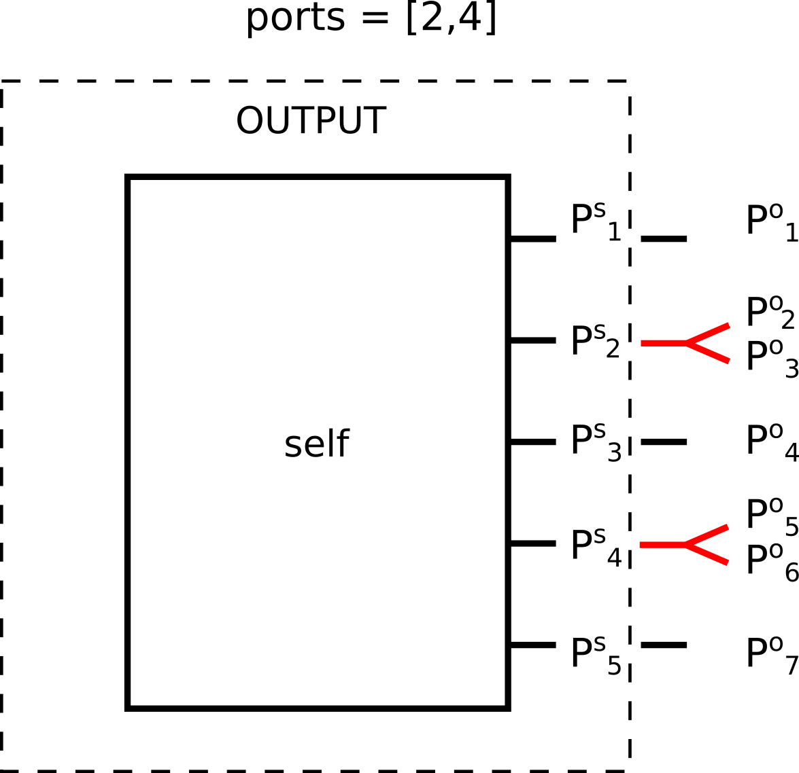
</p>

#### `duplicatePortsSeries(self, ports, comp_Pinc=True)`

The method splits in two serires ports, all the ports listed in ports. 

Parameters

* cls : *RF_Coil* class
* ports : *list*, *numpy.ndarray* <br>
*list* or *numpy.ndarray* listing the port numbers (starting from one) that have to be splitted. Each port can be splitted once only, therefore no repetitions are expected inside ports
* comp_Pinc : *bool*, *optional* <br>
if `True` (default value) and the `self.em_field` property is not `None`, the method returns an *RF_Coil* instance whose `em_field` property is updated according to the new connections. If the `self.em_field` property is `None`, the `em_field` property of the returned *RF_Coil* is `None` but connection data are stored in the new *RF_Coil*. If `False`, the `em_field` property of the returned *RF_Coil* is `None` and no connection data are stored

Returns

* RF_Coil : *RF_Coil*
*RF_Coil* instance whose selected ports are splitted in two parallel ports.

<p align="center">
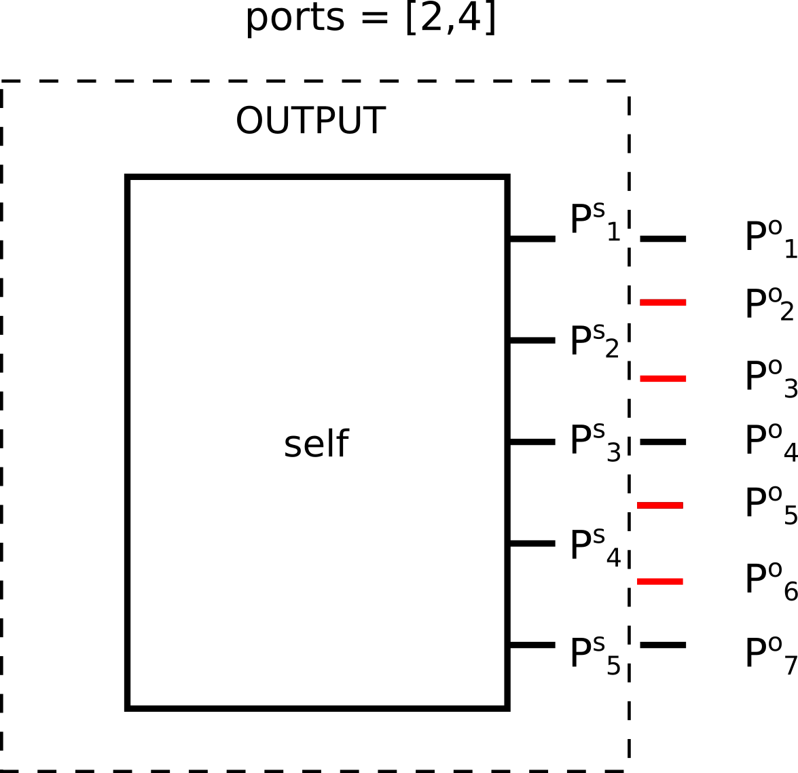
</p>

#### `powerBalance(self, p_inc, voxVols=None, elCond_key=None, printReport=False)`

when the ports of the device are supplied according to the incident powers listed in p_inc, the method computes the power balance comprising: the total reflected power, the power lost in the last connected network, the power deposited by the electric field, the sum of the radiated power and power lost in the unconnected device

Parameters

* p_inc : *list*, *numpy ndarray*
*list* or *numpy ndarray* with a length equal to the number of ports of the device. `p_inc[i]` is the power incident to the i-th port considered for the power balance computation
* voxVols : *int*, *float*
volume, in m<sup>3</sup>, of each voxel over which the electric field has been defined. If `None`, the power deposited by the elctric field is not accounted in the power balance computation. Default is `None`.
* elCond_key : *string*<br>
*string* of the key in the `self.properties` dictionary associated with the electrical conductivity. If `None`, the power deposited by the elctric field is not accounted in the power balance computation. Default is `None`
* printReport : *bool*<br>
if `True` a power balance report is printed when the method is called


Returns

* powBal : *dict* <br>
  dictionary with the following keys:
  - *P_inc_tot* : *numpy  ndarray*<br>
  N<sub>f</sub> elements *numpy  ndarray* reporting the total incident power at each frequency value. If the `em_field` property of the `RF_Coil` instance, the `e_field` property of the *EM_Field* instance, the `voxVols` argument or the `elCond_key` argument are `None`, N<sub>f</sub> is the number of frequency values over which the *S_Matrix* instance has been defined. Otherwise N<sub>f</sub> is the number of frequency values over which the *EM_Field* instance has been defined
  - *P_refl* : *numpy  ndarray*<br>
  N<sub>f</sub> elements *numpy  ndarray* reporting the total reflected power at each frequency value. If the `em_field` property of the `RF_Coil` instance, the `e_field` property of the *EM_Field* instance, the `voxVols` argument or the `elCond_key` argument are `None`, N<sub>f</sub> is the number of frequency values over which the *S_Matrix* instance has been defined. Otherwise N<sub>f</sub> is the number of frequency values over which the *EM_Field* instance has been defined
  - *P_dep* : *numpy  ndarray*, *optional*<br>
  N<sub>f</sub> elements *numpy  ndarray* reporting the power deposited by the electric field. N<sub>f</sub> is the number of frequency values over which the *EM_Field* instance has been defined. If the `em_field` property of the `RF_Coil` instance, the `e_field` property of the *EM_Field* instance, the `voxVols` argument or the `elCond_key` argument are `None`, this key will not be defined
  - *P_circ_loss* : N<sub>f</sub> elements *numpy  ndarray* reporting the power lost in the last connected network at each frequency value. If the `em_field` property of the `RF_Coil` instance, the `e_field` property of the *EM_Field* instance, the `voxVols` argument or the `elCond_key` argument are `None`, N<sub>f</sub> is the number of frequency values over which the *S_Matrix* instance has been defined. Otherwise N<sub>f</sub> is the number of frequency values over which the *EM_Field* instance has been defined. If the *RF_Coil* instance has never been connected to any external network or connection data have not been stored, this key will not be defined
  - *P_other* : N<sub>f</sub> elements *numpy  ndarray* reporting the power lost due to other type of losses (*e.g* radiation, power lost in the unconnected device) at each frequency value. *P_other* is computed as the total (at all ports) incident power subtracted by the other computed power losses. If the `em_field` property of the `RF_Coil` instance, the `e_field` property of the *EM_Field* instance, the `voxVols` argument or the `elCond_key` argument are `None`, N<sub>f</sub> is the number of frequency values over which the *S_Matrix* instance has been defined. Otherwise N<sub>f</sub> is the number of frequency values over which the *EM_Field* instance has been defined

#### `connectPorts(self, port_pairs, sMats, comp_Pinc=True)`

The method returns an *RF_Coil* instance where the port pairs of the `self` *RF_Coil* instance, listed in `port_pairs` aurgument, are connected together through the *S_Matrix* instances listed in `sMats`.

Parameters

* self : *RF_Coil*
* port_pairs : *list*, *numpy.ndarray* <br>
N<sub>PP</sub> 🞩 2 *list* or *numpy.ndarray* listing the port pairs that have to be connected together through the N<sub>PP</sub> *S_Matrix* instances listed in `sMats`
* sMats : *list*, *numpy.ndarray* <br>
N<sub>PP</sub> *list* or *numpy.ndarray* listing the *S_Matrix* instances used to connect together the port pairs listed in `port_pairs`. Each *S_Matrix* instance has to be defined over the same frequency values over which the `self.s_matrix` *S_Matrix* instance is defined
* comp_Pinc : *bool*, *optional* <br>
if `True` (default value) and the `self.em_field` property is not `None`, the method returns an *RF_Coil* instance whose `em_field` property is updated according to the new connections. If the `self.em_field` property is `None`, the `em_field` property of the returned *RF_Coil* is `None` but connection data are stored in the new *RF_Coil*. If `False`, the `em_field` property of the returned *RF_Coil* is `None` and no connection data are stored

<p align="center">
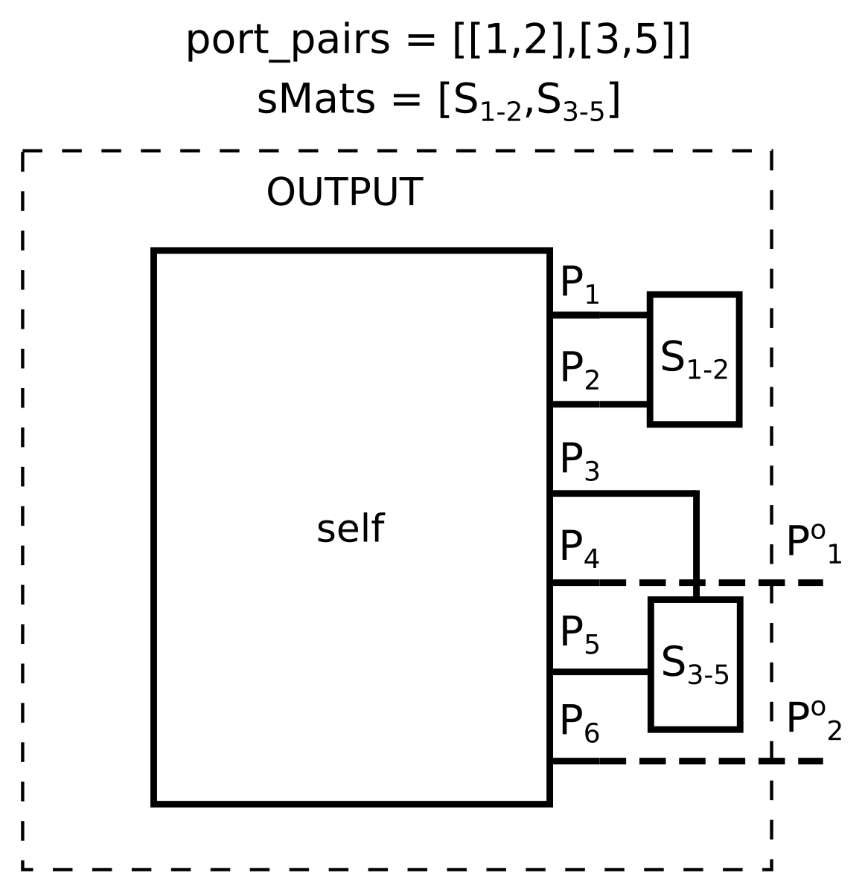
</p>

Returns

* s_load : *S_Matrix* <br>
*S_Matrix* instance with a number of ports equal to 2(N<sub>P</sub>-N<sub>PP</sub>), where N<sub>P</sub> is the number of ports of `self` and N<sub>PP</sub> is the number of port pairs that have to be connected together through the *S_Matrix* instances listed in `sMats`. 

#### `saveRFCoil(self, filename, description="")`

The method allows to save the *RF_Coil* instance in a binary format with *.cspy* extension.

Parameters

* self : *RF_Coil*
* filename : *string* <br>
*string* reporting the path and filename of the binary file containing the data relevant to the *RF_Coil* instance
* description : *string*, *optional* <br>
*string* containing optional information that can be saved as ASCII in the binary file header. Default is ""

Returns

* *None*

#### `loadRFCoil(cls, filename, **kwarg)`

*class method* that allows to load the *RF_Coil* instance stored in the binary file generated by the `saveRFCoil` method.

Parameters

* cls : *RF_Coil* class
* filename : *string* <br>
*string* reporting the path and filename of the binary *.cspy* file containing the data relevant to the *RF_Coil* instance

Returns

* RF_Coil : *RF_Coil*
*RF_Coil* instance loaded from the *.cspy* file