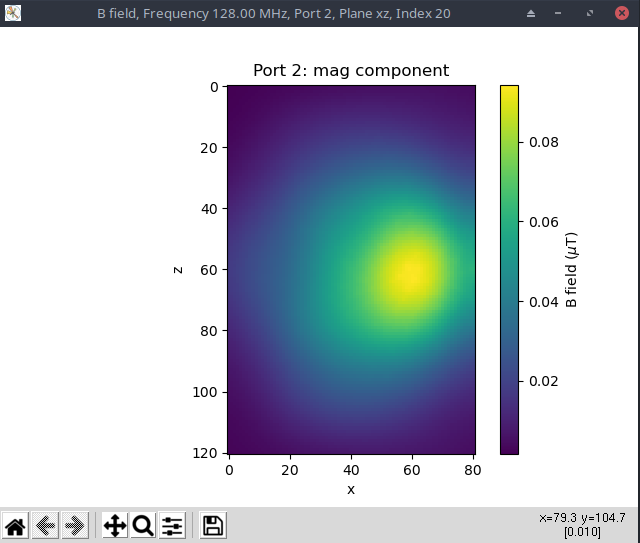
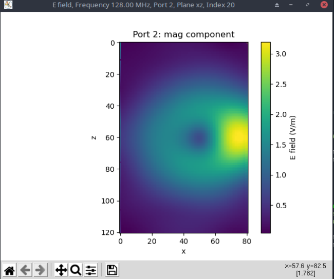

# CoSimPy
CoSimPy is an open source Pyhton library aiming to combine results from electromagnetic (EM) simulation with circuit analysis through a co-simulation environment.
The library is developed specifically to deal with Magnetic Resonance Imaging (MRI) radiofrequency (RF) coils. Nevertheless, it is sufficiently general to be adopted in any context involving EM multiport simulations.

The library is composed of three different classes:
* [S_Matrix class](#s_matrix-class)
* [EM_Field class](#em_field-class)
* [RF_Coil class](#rf_coil-class)

The **S_Matrix** class is defined to manage the scattering parameters associated with any specific circuit. These can be either the scattering parameters associated with the simulated RF coil or with any other circuit which has to be connected. Specific methods are defined to handle the connection between different instances of its class.

The **EM_Field** class is defined to manage the EM field generated by any port of the simulated device. 

The **RF_Coil** class represents the highest level class of the library. An instance of the RF_Coil class virtually represents the simulated device being, its properties, an *S_Matrix* instance managing the scattering parameters associated with the RF coil and an *EM_Field* instance managing the EM field generated by any port of the RF coil. This class is designed to handle the interaction between the scattering parameters and the EM field allowing the computation of the latter when the RF coil is connected to any other passive device.
___
## S_Matrix class
This class is defined to manage the scattering matrix (S matrix) associated with any specific circuit. These can be either the scattering parameters associated with the simulated RF coil or with any other circuit which has to be connected.

### Properties
* `S_Matrix.S` : *numpy ndarray* <br>
N<sub>f</sub> 🞩 N<sub>P</sub> 🞩 N<sub>P</sub> *numpy ndarray* representing an N<sub>P</sub> ports S matrix defined over N<sub>f</sub> frequency values
* `S_Matrix.frequencies` : *numpy ndarray* <br>
N<sub>f</sub> *numpy ndarray* representing the frequency values, in hertz, over which the scattering parameters are defined
* `S_Matrix.n_f` : *int* <br>
number of frequency values over which the scattering parameters are defined (N<sub>f</sub>)
* `S_Matrix.nPorts` : *int* <br>
number of ports associated with the S Matrix (N<sub>P</sub>)

### Methods

#### `__init__(self, S, freqs, z0=50)`

It creates an *S_Matrix* instance.

Parameters

* S : *numpy ndarray* <br>
N<sub>f</sub> 🞩 N<sub>P</sub> 🞩 N<sub>P</sub> *numpy ndarray* representing an N<sub>P</sub> ports S Matrix defined over N<sub>f</sub> frequency values
* freqs : *list* or *numpy ndarray* <br>
N<sub>f</sub> *list* or *numpy ndarray* representing the frequency values, in hertz, over which the scattering parameters are defined
* z0 : *float*, *list* or *numpy ndarray*, *optional*<br>
port impedances in ohm. These can be given as a N<sub>P</sub> *list* or *numpy ndarray*. If all the ports share the same impedances, a *float* value can be passed as parameter. Default is 50 ohm

Returns

* S_Matrix : *S_Matrix*

Example
```python
import numpy as np
from cosimpy import *

n_p = 5 #Number of ports
n_f = 10 #Number of frequency values 

frequencies = np.linspace(50e6, 150e6, n_f, endpoint=False))

s_real = np.random.rand(n_f,n_p,n_p)
s_imag = np.random.rand(n_f,n_p,n_p)
s = (s_real + 1j*s_imag) /np.max(np.abs(s_real + 1j*s_imag))

S_Matrix(s, frequencies)

'''
Out:

    """""""""""""""
       S MATRIX
    """""""""""""""

    |V-| = |S||V+|
    |5 x 1| = |5 x 5||5 x 1|

    Number of frequency values = 10

'''
```

#### `__repr__(self)`

Method for returning a printable representation of the *S_Matrix* instance.

Parameters

* self : *S_Matrix*
  
Returns

* string : *string* <br>
The string identifies the class of the instance. It gives a textual representation of the S matrix shape and reports the number of frequency values over which the scattering parameters are defined

#### `__getitem__(self, key)`

Indexing method for *S_Matrix* instances. Indices are interpreted as frequency values.

Parameters

* key : *tuple*, *list*, *numpy ndarray*, *int*, *float*, *slice* <br>
frequency values used to index the `self` *S_Matrix*

Returns

* S_Matrix : *S_Matrix*

Example
```python
import numpy as np
from cosimpy import *

n_p = 5 #Number of ports
n_f = 10 #Number of frequency values 

frequencies = np.linspace(50e6, 150e6, n_f, endpoint=False))

S_Mat = S_Matrix(np.random.uniform(size=(n_f,n_p,n_p)), frequencies)

S_Mat.frequencies

'''
Out:

    array([5.0e+07, 6.0e+07, 7.0e+07, 8.0e+07, 9.0e+07, 1.0e+08, 1.1e+08,
       1.2e+08, 1.3e+08, 1.4e+08])
'''

S_Mat[90e6:].frequencies

'''
Out:

    array([9.0e+07, 1.0e+08, 1.1e+08, 1.2e+08, 1.3e+08, 1.4e+08])
'''

S_Mat[90e6:130e6].frequencies

'''
Out:

    array([9.0e+07, 1.0e+08, 1.1e+08, 1.2e+08])
'''
S_Mat[95e6].frequencies

'''
Out:

'WARNING: 9.500000e+07 Hz is not contained in the frequencies list. 9.000000e+07 Hz is returned instead'
    array([90000000.])

'''
```

#### `__add__(self, other)`

\_\_add__ method for *S_Matrix* instances. It computes the *S_Matrix* resultant from the series among 1-port `self` and `other` *S_Matrix* instances. `self` and `other` must be defined over the same frequency values and must share the same port impedance.

Parameters

* self : *S_Matrix* <br>
1-port *S_Matrix*
* other : *S_Matrix* <br>
1-port *S_Matrix*

Returns

* S_Matrix : *S_Matrix* <br>
  1-port *S_Matrix*

Example
```python
import numpy as np
from cosimpy import *

n_f = 10 #Number of frequency values 

frequencies = np.linspace(50e6, 150e6, n_f, endpoint=False))

S_Mat1 = S_Matrix(np.random.uniform(size=(n_f,1,1)), frequencies)
S_Mat2 = S_Matrix(-1*np.ones((n_f,1,1)), frequencies) #S_Mat2: short circuit

S_res = S_Mat1 + S_Mat2

(np.round(S_res.S,6) == np.round(S_Mat1.S,6)).all()

'''
Out:

    True

'''
```

#### `__mul__(self, other)`

\_\_mul__ method for *S_Matrix* instances. It computes the *S_Matrix* resultant from the parallel among 1-port `self` and `other` *S_Matrix* instances. `self` and `other` must be defined over the same frequency values and must share the same port impedance.

Parameters

* self : *S_Matrix* <br>
1-port *S_Matrix*
* other : *S_Matrix* <br>
1-port *S_Matrix*

Returns

* S_Matrix : *S_Matrix* <br>
  1-port *S_Matrix*

Example
```python
import numpy as np
from cosimpy import *

n_f = 10 #Number of frequency values 

frequencies = np.linspace(50e6, 150e6, n_f, endpoint=False))

S_Mat1 = S_Matrix(np.random.uniform(size=(n_f,1,1)), frequencies)
S_Mat2 = S_Matrix(-1*np.ones((n_f,1,1)), frequencies) #S_Mat2: short circuit

S_res = S_Mat1 * S_Mat2

(S_res.S == -1).all()

'''
Out:

    True

'''
```

#### `plotS(self, parameters, dB=True, smooth=True)`

The method is used to plot the scattering parameters as a function of the frequency values over which they are defined.

Parameters

* parameters : *list* or *numpy ndarray* <br>
*list* or *numpy ndarray* identifying the scattering parapeters to plot. Each element of parameters must be a string formatted as "S\<n1>-\<n2>" where \<n1> and \<n2> are the relevant port numbers
* dB : *bool*, *optional* <br>
if `True`, the scattering parameters are plotted in Decibel. Otherwise, they are plotted as magnitude and phase. Default is `True`
* smooth : *bool*, *optional* <br>
if `True`, the scattering parameters are interpolated along their frequency range to produce smoother plots. Default is `True`

Returns

* None

Example
```python
import numpy as np
from cosimpy import *

n_p = 5 #Number of ports
n_f = 10 #Number of frequency values 

frequencies = np.linspace(50e6, 150e6, n_f, endpoint=False))

S_Mat = S_Matrix(np.random.uniform(size=(n_f,n_p,n_p)), frequencies)

S_Mat.plot(["S1-1, S1-2, S3-2"])
```

#### `getZMatrix(self)`

it returns the Z matrix associated with the *S_Matrix* `self`

Parameters

* self : *S_Matrix*

Returns

* Z : *numpy ndarray* <br>
  N<sub>f</sub> 🞩 N<sub>P</sub> 🞩 N<sub>P</sub> *numpy ndarray* of impedance parameters. N<sub>f</sub> is the number of frequency values over which `self` is defined and N<sub>P</sub> is the number of ports

#### `getYMatrix(self)`

it returns the Y matrix associated with the *S_Matrix* `self`

Parameters

* self : *S_Matrix*

Returns

* Y : *numpy ndarray* <br>
  N<sub>f</sub> 🞩 N<sub>P</sub> 🞩 N<sub>P</sub> *numpy ndarray* of admittance parameters. N<sub>f</sub> is the number of frequency values over which `self` is defined and N<sub>P</sub> is the number of ports

#### `_singlePortConnSMatrix(self, networks, comp_Pinc=False)`

The method performs the cascade connection between `self` and the *S_Matrix* instances contained in `networks` *list*.

Parameters

* self : *S_Matrix*
* networks : *list* <br>
*list*, with length equal to the number of ports of `self`, either containing `None` values or *S_Matrix* instances defined over the same frequency values of `self`. If the n-th element of `networks` is `None`, the n-th port of `self` is not connected to any other network in the returned *S_Matrix*. If the n-th element of `networks` is an N-ports *S_Matrix*, its first port must share the same impedance of the n-th port of `self` and the two ports are connected together. In the returned *S_Matrix*, the n-th port of `self` is therefore expanded into (N-ports - 1) ports. The example proposed in the image below should clarify the workflow


* comp_Pinc : *bool*, *optional* <br>
  if `True` the method returns the magnitude and 'phase' of the incident powers across the ports of `self` when each port of the returned S matrix is supplied with 1 W of incident power and all its other ports are closed on characteristic loads. Default is `False`

Returns

* S_res : *S_Matrix* <br>
  The *S_Matrix* which results from the connection. The *S_Matrix* is defined over the same frequency values of `self` and has a number of ports equal to N<sub>P</sub> - N<sub>T</sub> + &sum;<sub>i=1</sub><sup>N<sub>T</sub></sup>(N<sub>p,i</sub> - 1) where N<sub>P</sub> is the number of ports of `self`, N<sub>T</sub> is the number of *S_Matrix* instances in `networks` and N<sub>p,i</sub> is the number of ports of the i-th *S_Matrix* of `networks`. The n-th port impedance of S_res is equal to the impedance of the relevant port of `self` if it derives from a `None` element of `networks`. Otherwise, it is equal to the impedance of the relevant port of the *S_Matrix* of `networks` from which the port derives
* p_incM : *numpy ndarray*, *optional* <br>
  N<sub>f</sub> 🞩 N<sub>Pout</sub> 🞩 N<sub>P</sub> *numpy ndarray* where N<sub>f</sub> is the number of frequency values over which `self` is defined, N<sub>Pout</sub> is the number of ports of the returned *S_Matrix* and N<sub>P</sub> is the number of ports of `self`. PincM[i,j,k] represents the magnitude of the incident power at the k-port of `self` when the j-port of the output *S_Matrix* is supplied with 1 W incident power at a frequency equal to `self.frequencies[i]`
* phaseM : *numpy ndarray*, *optional* <br>
  N<sub>f</sub> 🞩 N<sub>Pout</sub> 🞩 N<sub>P</sub> *numpy ndarray* where N<sub>f</sub> is the number of frequency values over which `self` is defined, N<sub>Pout</sub> is the number of ports of the returned *S_Matrix* and N<sub>P</sub> is the number of ports of `self`. 
  phaseM[i,j,k] represents the 'phase' of the incident power at the k-port of `self` when the j-port of the output *S_Matrix* is supplied with 1 W incident power at a frequency equal to `self.frequencies[i]`

Example
```python
import numpy as np
from cosimpy import *

n_f = 10 #Number of frequency values 

frequencies = np.linspace(50e6, 150e6, n_f, endpoint=False))

s = np.repeat(np.array([[[0, 1], [1, 0]]]), n_f, axis=0) #Straight connection between port 1 and port 2
S_Mat = S_Matrix(s, frequencies)
S_ch = S_Matrix(np.zeros((n_f,1,1)), frequencies) #Characteristic load

S_res, p_incM, phaseM = S_Mat._singlePortConnSMatrix([None, S_ch], True)

np.array_equal(S_res.S,np.repeat([[[0]]],10,axis=0))

'''
Out:

    True
'''

np.array_equal(np.round(p_incM,10),np.repeat([[[1., 0.]]],n_f,axis=0))

'''
Out:

    True
'''

np.equal(phaseM, np.zeros_like(phaseM)).all()

'''
Out:

    True

'''
```

#### `_fullPortsConnSMatrix(self, other, comp_Pinc=False)`

The method performs the cascade connection between `self` and `other` *S_Matrix* instances.

Parameters

* self : *S_Matrix*
* other : *S_Matrix* <br>
*S_Matrix* instance defined over the same frequency values of `self` and with a number of ports higher than those of `self`. In the returned *S_Matrix*, the first N<sub>P</sub> ports of `other` are connected with the N<sub>P</sub> ports of `self` and must share the same port impedances
* comp_Pinc : *bool*, *optional* <br>
if `True` the method returns the magnitude and 'phase' of the incident powers across the ports of `self` when each port of the returned S matrix is supplied with 1 W of incident power and all its other ports are closed on characteristic loads. Default is `False`

Returns

* S_res : *S_Matrix* <br>
  The *S_Matrix* which results from the connection. The *S_Matrix* is defined over the same frequency values of `self` and has a number of ports equal to N<sub>Po</sub> - N<sub>P</sub> being N<sub>P</sub> the number of ports of `self` and N<sub>Po</sub> the number of ports of `other`. The port impedances of S_res will be equal to those of the last N<sub>Po</sub> ports of other
* p_incM : *numpy ndarray*, *optional* <br>
  N<sub>f</sub> 🞩 N<sub>Pout</sub> 🞩 N<sub>P</sub> *numpy ndarray* where N<sub>f</sub> is the number of frequency values over which `self` is defined, N<sub>Pout</sub> is the number of ports of the returned *S_Matrix* and N<sub>P</sub> is the number of ports of `self`. 
  PincM[i,j,k] represents the magnitude of the incident power at the k-port of `self` when the j-port of the output *S_Matrix* is supplied with 1 W incident power at a frequency equal to `self.frequencies[i]`
* phaseM : *numpy ndarray*, *optional* <br>
  N<sub>f</sub> 🞩 N<sub>Pout</sub> 🞩 N<sub>P</sub> *numpy ndarray* where N<sub>f</sub> is the number of frequency values over which `self` is defined, N<sub>Pout</sub> is the number of ports of the returned *S_Matrix* and N<sub>P</sub> is the number of ports of `self`. 
  phaseM[i,j,k] represents the 'phase' of the incident power at the k-port of `self` when the j-port of the output *S_Matrix* is supplied with 1 W incident power at a frequency equal to `self.frequencies[i]`

  Example
```python
import numpy as np
from scipy.linalg import circulant
from cosimpy import *

n_p = 2 #Number of ports
n_f = 10 #Number of frequency values 

frequencies = np.linspace(50e6, 150e6, n_f, endpoint=False))

S_Mat = S_Matrix(np.random.uniform(size=(n_f,n_p,n_p)), frequencies)

s_other = circulant([0,0,1,0]).T #Straight connection between ports 1 with port 3 and port 2 with port 4

s_other

'''
Out:

    array([[0, 0, 1, 0],
          [0, 0, 0, 1],
          [1, 0, 0, 0],
          [0, 1, 0, 0]])
'''

other = S_Matrix(np.repeat([s_other], n_f, axis=0), frequencies)

S_res, p_incM, phaseM = S_Mat._fullPortsConnSMatrix(other, True)

(np.round(S_res.S,10) == np.round(S_Mat.S,n_f)).all()

'''
Out:

    True
'''

np.equal(np.round(p_incM, 10),np.repeat([[[1,0],[0,1]]], n_f, axis=0)).all()

'''
Out:

    True
'''

np.equal(phaseM, np.zeros_like(phaseM)).all()

'''
Out:

    True

'''
```

#### `__resSMatrix(self, other)`

Private method used to compute the *S_Matrix* instance resulting from the connection of the N<sub>P</sub> ports of `self` with the first N<sub>P</sub> ports of `other`.

Parameters

* self : *S_Matrix*
* other : *S_Matrix* <br>
S_Matrix instance* defined over the same frequency values of `self` and with a number of ports higher than those of `self`. In the returned *S_Matrix*, the first N<sub>P</sub> ports of `other` are connected with the N<sub>P</sub> ports of `self` and must share the same port impedances


Returns

* S_res : *S_Matrix* <br>
  The *S_Matrix* which results from the connection of `self` with `other`. The *S_Matrix* is defined over the same frequency values of `self` and has a number of ports equal to N<sub>Po</sub> - N<sub>P</sub> being N<sub>P</sub> the number of ports of `self` and N<sub>Po</sub> the number of ports of `other`. The port impedances of S_res will be equal to those of the last N<sub>Po</sub> ports of other

#### `__load_Pinc(self, other, comp_Pinc=False)`

Private method used to compute the magnitude and 'phase' of the powers incident to the ports of `self` when the last port of `other` is supplied with 1 W incident power.

Parameters

* self : *S_Matrix*
* other : *S_Matrix* <br>
S_Matrix instance* defined over the same frequency values of `self` and with a number of ports equal to (N<sub>P</sub> + 1) where N<sub>P</sub> is equal to the number of ports of `self`. The first N<sub>P</sub> ports of `other` must share the same port impedances of the ports of `self`

Returns

* p_incM : *numpy ndarray* <br>
  N<sub>f</sub> 🞩 1 🞩 N<sub>P</sub> *numpy ndarray* where N<sub>f</sub> is the number of frequency values over which `self` is defined and N<sub>P</sub> is the number of ports of `self`. 
  PincM[i,0,k] represents the magnitude of the incident power at the k-port of `self` when the last port of `other` is supplied with 1 W incident power at a frequency equal to `self.frequencies[i]`
* phaseM : *numpy ndarray* <br>
  N<sub>f</sub> 🞩 1 🞩 N<sub>P</sub> *numpy ndarray* where N<sub>f</sub> is the number of frequency values over which `self` is defined and N<sub>P</sub> is the number of ports of `self`. 
  phaseM[i,0,k] represents the 'phase' of the incident power at the k-port of `self` when the last port of `other` is supplied with 1 W incident power at a frequency equal to `self.frequencies[i]`

#### `__findFreqIndex(self, freq)`

Private method which returns the index of `self.frequencies` corresponding to the frequency `freq`.

Parameters

* self : *S_Matrix*
* freq : *float* <br>

Returns

* idx : *int* <br>
Index of of `self.frequencies` corresponding to the frequency `freq`. In case `freq` is not in `self.frequencies`, the lower index of the nearest element of `self.frequencies` to `freq` is returned

#### `fromZtoS(Z, freqs, z0 = 50)`

*static method* used to return an *S_Matrix* starting from an impedance matrix defined over the frequency values listed in `freqs`.

Parameters

* Z : *numpy ndarray* <br>
N<sub>f</sub> 🞩 N<sub>P</sub> 🞩 N<sub>P</sub> *numpy ndarray* of impedance parameters. N<sub>f</sub> is the number of frequency values over which the impedance parameters are defined. N<sub>P</sub> is the number of ports
* freqs : *list*, *numpy ndarray* <br>
N<sub>f</sub> *list* or *numpy ndarray* containing the frequency values, in hertz, over which the impedance parameters are defined
* z0 : *int*, *float*, *list* or *numpy ndarray*, *optional*<br>
port impedances in ohm. These can be given as a N<sub>P</sub> *list* or *numpy ndarray*. If all the ports share the same impedances, an *int* or *float* value can be passed as parameter. Default is 50 ohm

Returns

* S_Matrix : *S_Matrix* <br>
*S_Matrix* obtained from the conversion of the impedance parameters and defined over the frequency values listed in `freqs`. The port impedances of the returned *S_Matrix* are given by the relevant method parameter

#### `fromYtoS(Z, freqs, y0 = 0.02)`

*static method* used to return an *S_Matrix* starting from an admittance matrix defined over the frequency values listed in `freqs`.

Parameters

* Z : *numpy ndarray* <br>
N<sub>f</sub> 🞩 N<sub>P</sub> 🞩 N<sub>P</sub> *numpy ndarray* of admittance parameters. N<sub>f</sub> is the number of frequency values over which the admittance parameters are defined. N<sub>P</sub> is the number of ports
* freqs : *list*, *numpy ndarray* <br>
N<sub>f</sub> *list* or *numpy ndarray* containing the frequency values, in hertz, over which the admittance parameters are defined
* y0 : *int*, *float*, *list* or *numpy ndarray*, *optional*<br>
port admittances. These can be given as a N<sub>P</sub> *list* or *numpy ndarray*. If all the ports share the same admittances, an *int* or *float* value can be passed as parameter.  Default is 0.02 S

Returns

* S_Matrix : *S_Matrix* <br>
*S_Matrix* obtained from the conversion of the admittance parameters and defined over the frequency values listed in `freqs`. The port impedances of the returned *S_Matrix* are obtained from the port admittances given by the relevant method parameter

#### `importTouchstone(filename, fmt='R_I', freqUnit='MHz', fix=False, n_f=None)`

*static method* used to return an *S_Matrix* importing the scattering parameters from a *Touchstone* file.

Parameters

* filename : *string* <br>
*string* reporting the *touchstone* file name
* fmt : *string*, *optional* <br>
*string* defining the format of the scattering parameters reported in the *touchstone* file. The string can be equal to:
  * 'R_I' : Real and Imaginary parts
  * 'Mag_Deg' : Magnitude and phase in degrees
  * 'dB_Deg' : Magnitude in decibel and phase in degrees
  * 'Mag_Rad' : Magnitude and phase in radians
  * 'dB_Rad' : Magnitude in decibel and phase in radians<br>
  
  Default is 'R_I'
  
* freqUnit : *string*, *optional*<br>
*string* defining the measurement unit of the frequency values reported in the *touchstone* file. It can be equal to 'Hz' or 'MHz'.  Default is 'MHz'
* fix : *bool*, *optional* <br>
if `True` the method tries to fix the *touchstone* file where more than one row of scattering parameters corresponds to each single frequency value. If `True` the method returns a new *touchstone* file in the same folder of the original one and named as 'filename_fixed.*'. Default is `False`
* n_f : *int*, *optional* <br>
number of frequency values over which the scattering parameters reported in the *touchstone* file are defined. This parameter is mandatory if `fix=True` otherwise it can be `None` (default value)

Returns

* S_Matrix : *S_Matrix* <br>
*S_Matrix* obtained from the *touchstone* file

#### `sMatrixRCseries(Rvalue, Cvalue, freqs, z0=50)`

*static method* used to return an *S_Matrix* of a 1-port Resistance-Capacitance series circuit.

Parameters

* Rvalue : *float* <br>
The resistance value in ohm
* Cvalue : *float* <br>
The capacitance value in farad
* freqs : *list*, *numpy ndarray*<br>
*list*, *numpy ndarray* reporting the frequency values, in hertz, over which the returned *S_Matrix* is defined
* z0 : *float*, *optional* <br>
The impedance, in ohm, of the port of the returned  *S_Matrix*. Default is 50 ohm

Returns

* S_Matrix : *S_Matrix* <br>
1-port *S_Matrix*, defined over the frequency values passed as method parameter, of a Resistance-Capacitance series. The port impedance is specified as method parameter

#### `sMatrixRLseries(Rvalue, Lvalue, freqs, z0=50)`

*static method* used to return an *S_Matrix* of a 1-port Resistance-Inductance series circuit.

Parameters

* Rvalue : *float* <br>
The resistance value in ohm
* Lvalue : *float* <br>
The inductance value in henry
* freqs : *list*, *numpy ndarray*<br>
*list*, *numpy ndarray* reporting the frequency values, in hertz, over which the returned *S_Matrix* is defined
* z0 : *float*, *optional* <br>
The impedance, in ohm, of the port of the returned *S_Matrix*.  Default is 50 ohm

Returns

* S_Matrix : *S_Matrix* <br>
1-port *S_Matrix*, defined over the frequency values passed as method parameter, of a Resistance-Inductance series. The port impedance is specified as method parameter

#### `sMatrixRCparallel(Rvalue, Cvalue, freqs, z0=50)`

*static method* used to return an *S_Matrix* of a 1-port Resistance-Capacitance parallel circuit.

Parameters

* Rvalue : *float* <br>
The resistance value in ohm
* Cvalue : *float* <br>
The capacitance value in farad
* freqs : *list*, *numpy ndarray*<br>
*list*, *numpy ndarray* reporting the frequency values, in hertz, over which the returned *S_Matrix* is defined
* z0 : *float*, *optional* <br>
The impedance, in ohm, of the port of the returned *S_Matrix*. Default is 50 ohm

Returns

* S_Matrix : *S_Matrix* <br>
1-port *S_Matrix*, defined over the frequency values passed as method parameter, of a Resistance-Capacitance parallel. The port impedance is specified as method parameter

#### `sMatrixRLparallel(Rvalue, Lvalue, freqs, z0=50)`

*static method* used to return an *S_Matrix* of a 1-port Resistance-Inductance parallel circuit.

Parameters

* Rvalue : *float* <br>
The resistance value in ohm
* Lvalue : *float* <br>
The inductance value in henry
* freqs : *list*, *numpy ndarray*<br>
*list*, *numpy ndarray* reporting the frequency values, in hertz, over which the returned *S_Matrix* is defined
* z0 : *float*, *optional* <br>
The impedance, in ohm of the port of the returned *S_Matrix*. Default is 50 ohm

Returns

* S_Matrix : *S_Matrix* <br>
1-port *S_Matrix*, defined over the frequency values passed as method parameter, of a Resistance-Inductance parallel. The port impedance is specified as method parameter

#### `sMatrixTnetwork(SL_1, SL_2, ST, z0=50)`

*static method* used to return an *S_Matrix* of a 2-port T-network.

Parameters

* SL_1 : *S_Matrix* <br>
The 1-port S_Matrix of the longitudinal parameter of the T-network towards the first port
* SL_2 : *S_Matrix* <br>
The 1-port S_Matrix of the longitudinal parameter of the T-network towards the second port
* ST : *S_Matrix* <br>
The 1-port S_Matrix of the transversal parameter of the T-network
* z0 : *int*, *float*, *list* or *numpy ndarray*, *optional*<br>
port impedances in ohm. These can be given as a N<sub>P</sub> *list* or *numpy ndarray*. If all the ports share the same impedances, an *int* or *float* value can be passed as parameter. Default is 50 ohm


Returns

* S_Matrix : *S_Matrix* <br>
2-port *S_Matrix*, of the T-network defined over the same frequency values over which SL_1, SL_2 and ST are defined. The impedances of the two ports are specified by the relevant method parameter

#### `sMatrixPInetwork(ST_1, ST_2, SL, z0=50)`

*static method* used to return an *S_Matrix* of a 2-port PI-network.

Parameters

* ST_1 : *S_Matrix* <br>
The 1-port S_Matrix of the transversal parameter of the PI-network towards the first port
* ST_2 : *S_Matrix* <br>
The 1-port S_Matrix of the transversal parameter of the PI-network towards the second port
* SL : *S_Matrix* <br>
The 1-port S_Matrix of the longitudinal parameter of the PI-network
* z0 : *int*, *float*, *list* or *numpy ndarray*, *optional*<br>
port impedances. These can be given as a N<sub>P</sub> *list* or *numpy ndarray*. If all the ports share the same impedances, an *int* or *float* value can be passed as parameter. Default is 50 ohm


Returns

* S_Matrix : *S_Matrix* <br>
2-port *S_Matrix*, of the PI-network defined over the same frequency values over which ST_1, ST_2 and SL are defined. The impedances of the two ports are specified by the relevant method parameter

#### `sMatrixTrLine(l, freqs, z0=50, c_f = 1, alpha=0)`

*static method* used to return an *S_Matrix* of a low-losses transmission line.

Parameters

* l : *float* <br>
length, in meters, of the transmission line
* freqs : *list*, *numpy ndarray*<br>
*list*, *numpy ndarray* reporting the frequency values, in hertz, over which the returned *S_Matrix* is defined
* z0 : *int*, *float*, *optional* <br>
The characteristic impedance, in ohm, of the transmission line. Default is 50 ohm
* c_f : *float*, *optional* <br
ratio between the propagation velocity in the transmission line and the speed of light. Default is 1
* alpha : *float*, *optional* <br>
attenuating coefficient of the transmission line. Default is 0 

Returns

* S_Matrix : *S_Matrix* <br>
2-port *S_Matrix*, of the transmission line defined over the frequency values given as method parameter. The impedances of the two ports are equal to the characteristic impedance of the transmission line given as method parameter

#### `__movePort(Smat, idx0, idx1)`

private *static method* used to return an *S_Matrix* where the `Smat` port at index `idx0` is exchanged with the port at index `idx1`.

Parameters

* Smat : *S_Matrix* <br>
* idx0 : *int*<br>
start point index. It can be included in the range 0 to (N<sub>P</sub>-1) where N<sub>P</sub> is the number of ports of `Smat`. The index can be also included in the range -N<sub>P</sub> to -1. In the last case `idx0 += N_P`
* idx1 : *int*<br>
end point index. It can be included in the range 0 to (N<sub>P</sub>-1) where N<sub>P</sub> is the number of ports of `Smat`. The index can be also included in the range -N<sub>P</sub> to -1. In the last case `idx1 += N_P`

Returns

* S_Matrix : *S_Matrix* <br>
*S_Matrix* where the `Smat` port at index `idx0` is exchanged with the port at index `idx1`. If `idx0 < idx1` it moves the port at `idx0` of `Smat` after the port at `idx1` of `Smat`. If `idx0 > idx1` it moves the port at `idx0` of `Smat` before the port at `idx1` of `Smat` <br>
If: <br>
`Smat_t = movePort(Smat, idx0, idx1)` <br>
it is always verified: <br>
`Smat == movePort(Smat_t, idx1, idx0)` <br>
___
## EM_Field class
This class is defined to manage harmonic electric and magnetic flux density fields generated by any multiport device.
The EM field must be computed on a regular cartesian grid (&Delta;x = &Delta;y = &Delta;z).

### Properties
* `EM_Field.b_field` : *numpy ndarray* or *None* <br>
N<sub>f</sub> 🞩 N<sub>P</sub> 🞩 3 🞩 N<sub>N</sub> *numpy ndarray* where N<sub>f</sub> is the number of frequency values over which the magnetic flux density field, expressed in tesla, is defined. N<sub>P</sub> is the number of ports of the device and N<sub>N</sub> is the number of spatial points over which the magnetic flux density field is defined. `EM_Field.b_field[i,k,j,n]` represents the rms of the `j` component of the magnetic flux density field at the frequency identified by the index `i`, when the port `k` is supplied with 1 W incident power in the point identified by index `n`. The values along the last axis of the array follow a fortran-like index ordering (first index changing faster)  considering a Cartesian coordinate system. It can be `None` if the magnetic flux density field is not defined.
* `EM_Field.e_field` : *numpy ndarray* or *None* <br>
N<sub>f</sub> 🞩 N<sub>P</sub> 🞩 3 🞩 N<sub>N</sub> *numpy ndarray* where N<sub>f</sub> is the number of frequency values over which the electric field, expressed in volts per meter, is defined. N<sub>P</sub> is the number of ports of the device and N<sub>N</sub> is the number of spatial points over which the electric field is defined. `EM_Field.e_field[i,k,j,n]` represents the rms of the `j` component of the electric field at the frequency identified by the index `i`, when the port `k` is supplied with 1 W incident power in the point identified by index `n`. The values along the last axis of the array follow a fortran-like index ordering (first index changing faster) considering a Cartesian coordinate system. It can be `None` if the electric field is not defined.
* `EM_Field.frequencies` : *numpy ndarray* <br>
N<sub>f</sub> *numpy ndarray* representing the frequency values, in hertz, over which electric and magnetic flux density fields are defined
* `EM_Field.nPoints` : *numpy ndarray* <br>
*numpy ndarray* with a length equal to three reporting the number of spatial points over which the electric and magnetic flux density fields are defined: [N<sub>x</sub>, N<sub>y</sub>, N<sub>z</sub>]
* `EM_Field.n_f` : *int* <br>
number of frequency values over which the electric and magnetic flux density fields are defined (N<sub>f</sub>)
* `EM_Field.nPorts` : *int* <br>
number of ports associated with the electric and magnetic flux density fields (N<sub>P</sub>)
* `EM_Field.properties` : *dict* <br>
*dictionary* which include additional properties related to the electric and magnetic flux density fields. These can be, for example, sample electric permittivity, electrical conductivity. Each additional property has to be defined over the same spatial points over which the electric and magnetic flux density fields are defined and must be represented by a *real* value.

### Methods

#### `__init__(self, freqs, nPoints, b_field=None, e_field=None, **kwargs)`

It creates an *EM_Field* instance. At least one among b_field and e_field must be different from `None`

Parameters

* freqs : *list* or *numpy ndarray* <br>
N<sub>f</sub> *list* or *numpy ndarray* representing the frequency values, in hertz, over which the electric and magnetic flux density fields are defined
* nPoints : *list* or *numpy ndarray* <br>
*list* or *numpy ndarray* with a length equal to three reporting the number of spatial points over which the electric and magnetic flux density fields are defined: [N<sub>x</sub>, N<sub>y</sub>, N<sub>z</sub>]
* b_field : *numpy ndarray*, *optional* <br>
N<sub>f</sub> 🞩 N<sub>P</sub> 🞩 3 🞩 N<sub>N</sub> *numpy ndarray* where N<sub>f</sub> is the number of frequency values over which the magnetic flux density field, expressed in tesla, is defined. N<sub>P</sub> is the number of ports of the device and N<sub>N</sub> is the number of spatial points over which the magnetic flux density field is defined. `b_field[i,k,j,n]` represents the rms of the `j` component of the magnetic flux density field at the frequency identified by the index `i`, when the port `k` is supplied with 1 W incident power in the point identified by index `n`. The values along the last axis of the array follow a fortran-like index ordering (first index changing faster) considering a Cartesian coordinate system. It can be `None` (default value) if the magnetic flux density field is not defined.
* e_field : *numpy ndarray*, *optional* <br>
N<sub>f</sub> 🞩 N<sub>P</sub> 🞩 3 🞩 N<sub>N</sub> *numpy ndarray* where N<sub>f</sub> is the number of frequency values over which the electric field, expressed in volts per meter, is defined. N<sub>P</sub> is the number of ports of the device and N<sub>N</sub> is the number of spatial points over which the electric field is defined. `EM_Field.e_field[i,k,j,n]` represents the rms of the `j` component of the electric field at the frequency identified by the index `i`, when the port `k` is supplied with 1 W incident power in the point identified by index `n`. The values along the last axis of the array follow a fortran-like index ordering (first index changing faster)  considering a Cartesian coordinate system. It can be `None` (default value) if the electric field is not defined.
* **kwargs : *list*, *numpy ndarray*, *optional* <br>
additional properties defined over the same N<sub>N</sub> spatial points over which the electric and magnetic flux density fields are defined. They can be *list* or *numpy ndarray* with a length equal to N<sub>N</sub>

Returns

* EM_Field : *EM_Field*

Example
```python
import numpy as np
from cosimpy import *

n_p = 5 #Number of ports
n_f = 10 #Number of frequency values
nPoints = [3,4,5] #Number of points along the three Cartesian directions

frequencies = np.linspace(50e6, 150e6, n_f, endpoint=False))

bfield = np.random.rand(n_f,n_p,3,np.prod(nPoints)) + 1j*np.random.rand(n_f,n_p,3,np.prod(nPoints))

cond = np.random.uniform(size=np.prod(nPoints))

EM_Field(frequencies, nPoints, b_field=bfield, conductivity=cond)

'''
Out:

    """""""""""""""
        EM FIELD
    """""""""""""""

    Number of frequency values = 10
    Number of ports = 5
    Number of point (nx, ny, nz) = 3, 4, 5

    E field not defined

    'conductivity' additional property defined

'''
```

#### `__repr__(self)`

Method for returning a printable representation of the *EM_Field* instance.

Parameters

* self : *EM_Field*
  
Returns

* string : *string* <br>
The string identifies the class of the instance. It reports the number of frequency values, the number of ports and the number of spatial points over which the EM field is defined

#### `compSensitivities(self)`

If the magnetic flux density field is defined, the method returns the complex B<sub>1</sub><sup>+</sup> and B<sub>1</sub><sup>-</sup> values.

Parameters

* self : *EM_Field*
  
Returns

* sens : *numpy ndarray* <br>
N<sub>f</sub> 🞩 N<sub>P</sub> 🞩 2 🞩 N<sub>N</sub> *numpy ndarray* where N<sub>f</sub> is the number of frequency values over which the sensitivity, expressed in tesla, are defined. N<sub>P</sub> is the number of ports of the device and N<sub>N</sub> is the number of spatial points over which the sensitivities are defined. `sens[i,k,j,n]` represents the B<sub>1</sub><sup>+</sup> (if `j` is equal to 0) or B<sub>1</sub><sup>-</sup> (if `j` is equal to 1) complex value at the frequency identified by the index `i`, generated by 1 W incident power at port `k` in the point identified by index `n`. The values along the last axis of the array follow a fortran-like index ordering (first index changing faster) considering a Cartesian coordinate system

#### `plotB(self, comp, freq, port, plane, sliceIdx, vmin=None, vmax=None)`

Method for plotting the magnetic flux density field over a specific slice



Parameters

* self : *EM_Field*
* comp : *string* <br>
component of the magnetic flux density field, in microtesla, to be plotted. It can take the following values:
  * 'x' : x-component
  * 'y' : y-component
  * 'z' : z-component
  * 'mag' : magnitude of the magnetic flux density field vector (rms value)
  * 'b1+' : magnitude of B<sub>1</sub><sup>+</sup>
  * 'b1-' : magnitude of B<sub>1</sub><sup>-</sup>
* freq : *float* <br>
frequency, in hertz, of the magnetic flux density field to be plotted
* port : *int* <br>
port number which is supplied with 1 W incident power to generate the magnetic flux density field. All the other ports are closed on matched loads. It can take values from 1 to N<sub>P</sub> being N<sub>P</sub> the number of ports of the device
* plane : *string* <br>
slice to be plotted. It can take the following values:
  * 'xy' : axial slice
  * 'xz' : coronal slice
  * 'yz' : sagittal slice
* sliceIdx : *int* <br>
index of the slice to be plotted. It can take negative values. In that case `sliceIdx = Ns + sliceIdx` where Ns is the total number of slices in the relevant direction
* vmin *float*, *optional* <br>
minimum value, in microtesla, of the chromatic bar. Default is `None` 
* vmax *float*, *optional* <br>
maximum value, in microtesla, of the chromatic bar. Default is `None` 

Returns

* None

#### `plotE(self, comp, freq, port, plane, sliceIdx, vmin=None, vmax=None)`

Method for plotting the melectric field over a specific slice



Parameters

* self : *EM_Field*
* comp : *string* <br>
component of the electric field, in volts per meter, to be plotted. It can take the following values:
  * 'x' : x-component
  * 'y' : y-component
  * 'z' : z-component
  * 'mag' : magnitude of the electric field vector (rms value)
* freq : *float* <br>
frequency, in hertz, of the electric field to be plotted
* port : *int* <br>
port number which is supplied with 1 W incident power to generate the electric field. All the other ports are closed on matched loads. It can take values from 1 to N<sub>P</sub> being N<sub>P</sub> the number of ports of the device
* plane : *string* <br>
slice to be plotted. It can take the following values:
  * 'xy' : axial slice
  * 'xz' : coronal slice
  * 'yz' : sagittal slice
* sliceIdx : *int* <br>
index of the slice to be plotted. It can take negative values. In that case `sliceIdx = Ns + sliceIdx` where Ns is the total number of slices in the relevant direction
* vmin *float*, *optional* <br>
minimum value, in volts per meter, of the chromatic bar. Default is `None` 
* vmax *float*, *optional* <br>
maximum value, in volts per meter, of the chromatic bar Default is `None` 

Returns

* None

#### `exportXMF(self, filename)`

Method for generating a .xmf and a .h5 file to be imported in data analysis and visualization applications such as [ParaView](https://www.paraview.org/). In the .h5 files, the electric field and magnetic flux density field are stored as <f\>MHz-p<n\>-<F\>_<type\> where <f\> is the frequency value in megahertz, <n\> is the port number, <F\> is 'E' (electric field) or 'B' (magnetic flux density field) and <type\> can be 'real' or 'imag' identifying the real or imaginary part of the field phasor. Additional properties, defined along the *EM_Field* instance, are stored with their full name in the .h5 file.


Parameters

* self : *EM_Field*
* filename : *string* <br>
name of the .xmf and .h5 files

Returns

* None

#### `_newFieldComp(self, p_inc, phase)`

It returns an *EM_Field* instance where the EM fields are updated according to new incident powers whose magnitude and 'phase' are contained in `p_inc` and `phase` *numpy ndarray*

Parameters

* self : *EM_Field*
* p_incM : *numpy ndarray* <br>
N<sub>f</sub> 🞩 N<sub>Pout</sub> 🞩 N<sub>P</sub> *numpy ndarray* where N<sub>f</sub> is the number of frequency values over which `self` is defined, N<sub>Pout</sub> is the number of ports of the returned *EM_Field* instance and N<sub>P</sub> is the number of ports of `self`. 
PincM[i,j,k] represents the magnitude of the incident power at the k-port of `self` when the j-port of the output *EM_Field* is supplied with 1 W incident power at a frequency equal to `self.frequencies[i]`
* phaseM : *numpy ndarray* <br>
N<sub>f</sub> 🞩 N<sub>Pout</sub> 🞩 N<sub>P</sub> *numpy ndarray* where N<sub>f</sub> is the number of frequency values over which `self` is defined, N<sub>Pout</sub> is the number of ports of the returned *EM_Field* instance and N<sub>P</sub> is the number of ports of `self`. 
PincM[i,j,k] represents the magnitude of the incident power at the k-port of `self` when the j-port of the output *EM_Field* is supplied with 1 W incident power at a frequency equal to `self.frequencies[i]`

Returns

* EM_Field : *EM_Field* <br>
*EM_Field* defined over the same frequency values of `self` *EM_Field*. The returned *EM_Field* is characterised by N<sub>Pout</sub> different distributions of EM fields corresponding to the number of rows of `p_incM` and `phaseM` method parameters

#### `importFields_cst(directory, freqs, nPorts, nPoints=None, Pinc_ref=1, b_multCoeff=1, pkORrms='pk', imp_efield=True, imp_bfield=True, **kwargs)`

Static method which returns an *EM_Field* instance importing the data from [CST<sup>®</sup> STUDIO SUITE](https://www.3ds.com/products-services/simulia/products/cst-studio-suite/) standard ASCII export files whose columns are formatted as:

|x, y, z, <EM\>xRe, <EM\>yRe, <EM\>zRe, <EM\>xIm, <EM\>yIm, <EM\>zIm|

Results files must be collected in a dedicated directory and named as <field_str/>_<freq_str/>_port<n/>.txt where <field_str/> can be either 'efield', for the electric field result, or 'bfield' for magnetic flux density field results, <freq_str/> is a string identifying the frequency value in megahertz (e.g. '128.4') and <n/> is the number of the port supplied, in the simulation environment, to generate the relevant EM fields. All the EM quantities must be exported on the same regular grid.

Parameters

* directory : *string* <br>
*string* reporting the path of the directory which contains the text files
* freqs : *list*, *numpy ndarray* <br>
*list* or *numpy ndarray* of *string* values reporting the frequency values as they are indicated in the results filenames (<freq_str/>)
* nPorts : *int* <br>
number of ports for which the results are available
* nPoints : *list*, *numpy ndarray*, *optional* <br>
*list* or *numpy ndarray* with a length equal to three reporting the number of spatial points over which the electric and magnetic flux density fields are defined: [N<sub>x</sub>, N<sub>y</sub>, N<sub>z</sub>]. If `None` (default value) the method deduces them from the result files at the expenses of a slight longer import process
* Pinc_ref : *float*, *optional* <br>
magnitude of the power incident at the ports which generate the EM fields.  Default is 1 W.
* b_multCoeff : *float*, *optional* <br>
multiplicative factor for the magnetic results. In case the exported results are magnetic field values (A/m), it has to be equal to 4&pi;10<sup>-7</sup> to obtain magnetic flux density values in tesla. Default is 1
* pkORrms : *string*, *optional* <br>
if 'pk' the values contained in the result files are interpreted as peak values, if 'rms' they are interpreted as rms values. Default is 'pk'
* imp_efield : *bool*, *optional* <br>
if `True` the method imports the results relevant to the electric field. Default is `True`
* imp_bfield : *bool*, *optional* <br>
if `True` the method imports the results relevant to the magnetic flux density field. Default is `True`
* **kwargs : *list*, *numpy ndarray*, *optional* <br>
additional properties defined over the same N<sub>N</sub> spatial points over which the electric and magnetic flux density fields are defined. They can be *list* or *numpy ndarray* with a length equal to N<sub>N</sub>

Returns

* EM_Field : *EM_Field* <br>
*EM_Field* obtained from the EM results exported from CST<sup>®</sup> STUDIO SUITE. `EM_Field.properties` is a dictionary based on the `**kwargs`parameters passed to the method

#### `importFields_s4l(directory, freqs, nPorts, Pinc_ref=1, b_multCoeff=1, pkORrms='pk', imp_efield=True, imp_bfield=True, **kwargs)`

Static method which returns an *EM_Field* instance importing the data from [Sim4Life](https://zmt.swiss/sim4life/) standard export .mat files. Results files must be collected in a dedicated directory and named as <field_str/>_port<n/>.mat where <field_str/> can be either 'efield', for the electric field results, or 'bfield' for magnetic flux density field results and <n/> is the number of the ports supplied, in the simulation environment, to generate the relevant EM field. All the EM quantities must be exported on the same regular grid.

Parameters

* directory : *string* <br>
*string* reporting the path of the directory which contains the .mat files
* freqs : *list*, *numpy ndarray* <br>
*list* or *numpy ndarray* of *float* values reporting the sorted frequency values at which the results have been exported from Sim4Life
* nPorts : *int* <br>
number of ports for which the results are available
* nPoints : *list*, *numpy ndarray*, *optional* <br>
*list* or *numpy ndarray* with a length equal to three reporting the number of spatial points over which the electric and magnetic flux density fields are defined: [N<sub>x</sub>, N<sub>y</sub>, N<sub>z</sub>]. If `None` (default value) the method deduces them from the result files at the expenses of a slight longer import process
* Pinc_ref : *float*, *optional* <br>
magnitude of the power incident at the ports which generate the EM fields.  Default is 1 W.
* b_multCoeff : *float*, *optional* <br>
multiplicative factor for the magnetic results. In case the exported results are magnetic field values (A/m), it has to be equal to 4&pi;10<sup>-7</sup> to obtain magnetic flux density values in tesla. Default is 1
* pkORrms : *string*, *optional* <br>
if 'pk' the values contained in the result files are interpreted as peak values, if 'rms' they are interpreted as rms values. Default is 'pk'
* imp_efield : *bool*, *optional* <br>
if `True` the method imports the results relevant to the electric field. Default is `True`
* imp_bfield : *bool*, *optional* <br>
if `True` the method imports the results relevant to the magnetic flux density field. Default is `True`
* **kwargs : *list*, *numpy ndarray*, *optional* <br>
additional properties defined over the same N<sub>N</sub> spatial points over which the electric and magnetic flux density fields are defined. They can be *list* or *numpy ndarray* with a length equal to N<sub>N</sub>

Returns

* EM_Field : *EM_Field* <br>
*EM_Field* obtained from the EM results exported from Sim4Life. `EM_Field.properties` is a dictionary based on the `**kwargs` parameters passed to the method

___
## RF_Coil class
This class represents the link between the *S_Matrix* and *EM_Field* classes. An instance of this class represents the simulated device being, its properties, an *S_Matrix* and an *EM_Field* instance. The *S_Matrix* must be defined over all the frequency values at which the *EM_Field* is defined.

### Properties
* `RF_Coil.s_matrix` : *S_Matrix*<br>
*S_Matrix* instance defined over N<sub>f,s</sub> frequency values and with N<sub>P</sub> ports
* `RF_Coil.em_field` : *EM_Field*<br>
*EM_Field* instance defined over N<sub>f,em</sub> frequency values and with N<sub>P</sub> ports

### Methods

#### `__init__(self, s_matrix, em_field=None)`

It creates an *RF_Coil* instance.

Parameters

* s_matrix : *S_Matrix*<br>
*S_Matrix* instance defined over N<sub>f,s</sub> frequency values and with N<sub>P</sub> ports
* em_field : *EM_Field*, optional<br>
*EM_Field* instance defined over N<sub>f,em</sub> frequency values and with N<sub>P</sub> ports. Default is `None`

Returns

* RF_Coil : *RF_Coil*

Example
```python
import numpy as np
from cosimpy import *

n_p = 5 #Number of ports
n_f = 10 #Number of frequency values
nPoints = [3,4,5] #Number of points for EM field along the three Cartesian directions

frequencies = np.linspace(50e6, 150e6, n_f, endpoint=False))

s_matrix = S_Matrix(np.random.uniform(size=(n_f,n_p,n_p)), freqs=frequencies)

bfield = np.random.rand(n_f,n_p,3,np.prod(nPoints))

em_field = EM_Field(frequencies, nPoints, b_field=bfield)

'''
Out:

    """""""""""""""
        RF COIL
    """""""""""""""


"""""""""""""""
   S MATRIX
"""""""""""""""

|V-| = |S||V+|
|5 x 1| = |5 x 5||5 x 1|

Number of frequency values = 10

"""""""""""""""
   EM FIELD
"""""""""""""""

Number of frequency values = 10

Number of points = (3, 4, 5)

E field not defined

'''
```

#### `__repr__(self)`

Method for returning a printable representation of the *RF_Coil* instance.

Parameters

* self : *RF_Coil*
  
Returns

* string : *string* <br>
The string identifies the class of the instance. It reports information about the *S_Matrix* and *EM_Field* properties

#### `singlePortConnRFcoil(self, networks, comp_Pinc=False)`

The method performs the cascade connection between `self` and the *S_Matrix* instances contained in `networks` *list*. 

Parameters

* self : *RF_Coil*
* networks : *list* <br>
*list* with length equal to the number of port of `self.s_matrix` either containing `None` values or *S_Matrix* instances defined over the same frequency values of `self.s_matrix`. If the n-th element of `networks` is `None`, the n-th port of `self` is not connected to any other network in the returned *RF_Coil*. If the n-th element of `networks` is an N-ports *S_Matrix*, its first port must share the same impedance of the n-th port of `self` and the two ports are connected together. In the returned *RF_Coil*, the n-th port of `self` is therefore expanded into (N-ports - 1) ports. The example proposed in the image below should clarify the workflow


* comp_Pinc : *bool*, *optional* <br>
if `True` the method returns an *RF_Coil* instance whose `em_field` property is updated according to the new connections. If `False` (default value), the `em_field` property of the returned *RF_Coil* is `None`

Returns

* RF_Coil : *RF_Coil* <br>
The new *RF_Coil* resulting form the connection of the original `self` *RF_Coil* with the *S_Matrix* instances contained in `networks`. It is worth noting that, if any of the network in the `networks` *list*, generates, under the given supplying conditions, an EM field which is not negligible with respect to that generated by the unconnected RF coil, the EM field associated with the returned *RF_Coil* can be inaccurate

#### `fullPortsConnRFcoil(self, s_matrix_other, comp_Pinc=False)`

The method performs the cascade connection between `self` and `other` *S_Matrix* instance.

Parameters

* self : *RF_Coil*
* other : *S_Matrix* <br>
*S_Matrix* instance defined over the same frequency values of `self.s_matrix` and with a number of ports higher than those of `self`. In the returned *RF_Coil*, the first N<sub>P</sub> ports of `other` are connected with the N<sub>P</sub> ports of `self` and must share the same port impedances
* comp_Pinc : *bool*, *optional* <br>
if `True` the method returns an *RF_Coil* instance whose `em_field` property is updated according to the new connections. If `False` (default value), the `em_field` property of the returned *RF_Coil* is `None`

Returns

* RF_Coil : *RF_Coil* <br>
The new *RF_Coil* resulting form the connection of the original `self` *RF_Coil* with the *S_Matrix* `other`. It is worth noting that, if the network, described by the *S_Matrix* `other`, generates, under the given supplying conditions, an EM field which is not negligible with respect to that generated by the unconnected RF coil, the EM field associated with the returned *RF_Coil* can be inaccurate